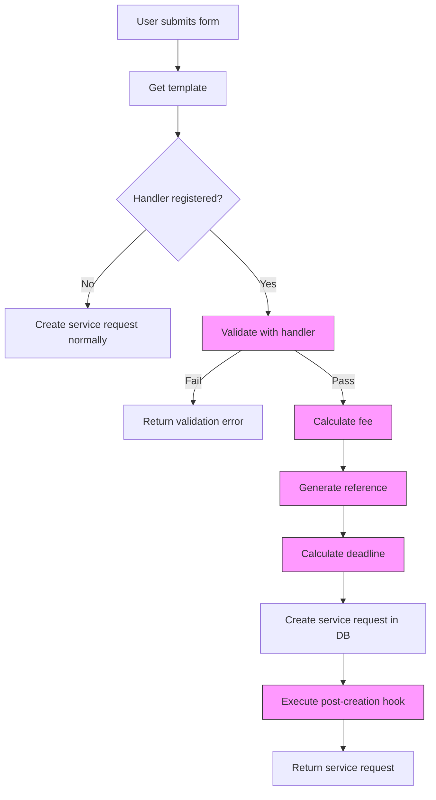

## Overview

The **Service Request Handler Pattern** provides a plugin-based system for adding regulator-specific custom logic to service request creation. This allows 90% of service requests to work through template configuration alone, while providing an escape hatch for the 10% that need custom business logic.

## Architecture

### Core Principles

1. **Handlers are Optional** - Most templates don't need handlers
2. **Graceful Degradation** - Handler failures don't block service request creation
3. **Single Responsibility** - Each handler manages one service type
4. **Type-Safe** - Full TypeScript support throughout
5. **Testable** - Handlers are pure functions easy to unit test

### Components

```
packages/api-services/src/domains/
├── handlers/
│   ├── handler-interface.ts      # Handler contract
│   ├── handler-registry.ts        # Singleton registry
│   ├── bootstrap.ts               # Registration at startup
│   └── __tests__/                 # Unit tests
├── utils/
│   ├── reference-generator.ts     # Reference number utilities
│   ├── deadline-calculator.ts     # Deadline calculation utilities
│   └── __tests__/                 # Unit tests
├── pacra/handlers/
│   ├── name-clearance.handler.ts  # Example PACRA handler
│   └── __tests__/
├── zra/handlers/
│   ├── paye-submission.handler.ts # Example ZRA handler
│   └── __tests__/
└── napsa/handlers/
    ├── certificate.handler.ts     # Example NAPSA handler
    └── __tests__/
```

## Handler Interface

Handlers implement the `ServiceRequestHandler` interface with **all methods optional**:

```typescript
interface ServiceRequestHandler {
  // Metadata
  readonly handlerKey: string;      // e.g., "pacra_name_clearance"
  readonly regulatorKey: string;    // e.g., "pacra"

  // Optional methods
  calculateFee?(ctx: HandlerContext): Promise<number> | number;
  generateReferenceNumber?(ctx: HandlerContext): Promise<string> | string;
  calculateDeadline?(ctx: HandlerContext): Promise<Date> | Date;
  validateIntakeData?(ctx: HandlerContext): Promise<HandlerResult<void>>;
  onServiceRequestCreated?(ctx: HandlerContext): Promise<HandlerResult<void>>;
}
```

### Handler Context

```typescript
interface HandlerContext {
  organizationId: string;
  templateId: string;
  templateKey?: string;
  regulatorId?: string;
  intakeData: unknown;              // Form data from user
  submissionDate: Date;
  serviceRequestId?: string;        // Available in post-creation hook
}
```

## When to Use Handlers

### ✅ Use Handlers When:

- **Dynamic Fee Calculation** - Fee depends on user input (e.g., business type)
- **Reference Generation** - Need to generate unique reference numbers with specific format
- **Deadline Calculation** - Deadline based on complex business rules
- **Custom Validation** - Beyond what Zod schema can express
- **Post-Creation Actions** - Need to trigger external systems after creation

### ❌ Don't Use Handlers When:

- **Static Configuration** - Template fields can express it
- **Simple Validation** - Zod schema is sufficient
- **Generic Logic** - Belongs in shared utilities

## Creating a Handler

### Step 1: Create Handler Class

```typescript
// packages/api-services/src/domains/zra/handlers/vat-registration.handler.ts

import type {
  HandlerContext,
  HandlerResult,
  ServiceRequestHandler,
} from "../../handlers/handler-interface";
import { zraReferences } from "../../utils/reference-generator";
import { deadlinePatterns } from "../../utils/deadline-calculator";

interface VatRegistrationIntake {
  annualTurnover?: number;
  businessType?: string;
}

export class VatRegistrationHandler implements ServiceRequestHandler {
  readonly handlerKey = "zra_vat_registration";
  readonly regulatorKey = "zra";

  async calculateFee(ctx: HandlerContext): Promise<number> {
    const intake = ctx.intakeData as VatRegistrationIntake;
    const turnover = intake?.annualTurnover ?? 0;

    // Fee based on turnover
    if (turnover >= 800_000) {
      return 500.00;
    }
    return 0.00; // Voluntary registration is free
  }

  generateReferenceNumber(): string {
    return zraReferences.vatRegistration();
  }

  calculateDeadline(ctx: HandlerContext): Date {
    // VAT registration: 14 business days
    return deadlinePatterns.standardTurnaround(ctx.submissionDate, 14);
  }

  async validateIntakeData(
    ctx: HandlerContext
  ): Promise<HandlerResult<void>> {
    const intake = ctx.intakeData as VatRegistrationIntake;

    if (!intake?.annualTurnover) {
      return {
        success: false,
        error: "Annual turnover is required",
      };
    }

    if (intake.annualTurnover < 0) {
      return {
        success: false,
        error: "Annual turnover must be positive",
      };
    }

    return { success: true };
  }
}
```

### Step 2: Register Handler

Add to `packages/api-services/src/domains/handlers/bootstrap.ts`:

```typescript
import { VatRegistrationHandler } from "../zra/handlers/vat-registration.handler";

export function bootstrapHandlers(): void {
  handlerRegistry.clear();

  // ... existing handlers
  handlerRegistry.register(new VatRegistrationHandler());

  // ... logging
}
```

### Step 3: Create Service Template

In backoffice, create service template with matching `templateKey`:

```json
{
  "templateKey": "zra_vat_registration",
  "name": "ZRA - VAT Registration",
  "regulatorId": "uuid-for-zra",
  "intakeFieldsSchema": [
    {
      "key": "annualTurnover",
      "label": "Annual Turnover (ZMW)",
      "type": "number",
      "required": true
    },
    {
      "key": "businessType",
      "label": "Business Type",
      "type": "select",
      "required": true,
      "options": [
        { "value": "sole_trader", "label": "Sole Trader" },
        { "value": "partnership", "label": "Partnership" },
        { "value": "company", "label": "Company" }
      ]
    }
  ]
}
```

### Step 4: Write Tests

```typescript
// packages/api-services/src/domains/zra/handlers/__tests__/vat-registration.handler.test.ts

import { describe, it, expect } from "vitest";
import { VatRegistrationHandler } from "../vat-registration.handler";

describe("VatRegistrationHandler", () => {
  const handler = new VatRegistrationHandler();

  it("should calculate fee for high turnover", async () => {
    const ctx = {
      organizationId: "org_test",
      templateId: "tmpl_test",
      intakeData: { annualTurnover: 1_000_000 },
      submissionDate: new Date(),
    };

    const fee = await handler.calculateFee(ctx);
    expect(fee).toBe(500.00);
  });

  it("should be free for low turnover", async () => {
    const ctx = {
      organizationId: "org_test",
      templateId: "tmpl_test",
      intakeData: { annualTurnover: 500_000 },
      submissionDate: new Date(),
    };

    const fee = await handler.calculateFee(ctx);
    expect(fee).toBe(0.00);
  });

  // ... more tests
});
```

## Handler Execution Flow

### Service Request Creation



### Error Handling

All handler methods are wrapped in try-catch blocks:

```typescript
// 1. Validation errors BLOCK creation
try {
  const result = await handler.validateIntakeData(ctx);
  if (!result.success) {
    throw new ServiceError("BAD_REQUEST", result.error);
  }
} catch (error) {
  throw error; // Propagate to client
}

// 2. Fee/reference/deadline errors are LOGGED but don't block
try {
  const fee = await handler.calculateFee(ctx);
} catch (error) {
  logger.warn({ error }, "Fee calculation failed, proceeding without");
  // Continue without fee
}

// 3. Post-creation hook errors are LOGGED only
try {
  await handler.onServiceRequestCreated(ctx);
} catch (error) {
  logger.error({ error }, "Post-creation hook failed (non-blocking)");
  // Service request already created, don't fail
}
```

## Utilities

### Reference Generator

Pre-built reference generators for common patterns:

```typescript
import {
  pacraReferences,
  zraReferences,
  napsaReferences,
  nhimaReferences
} from "@repo/api-services/domains/utils";

// PACRA
pacraReferences.nameClearance();              // PACRA-NC-2026-02-12345
pacraReferences.companyRegistration();        // PACRA-REG-2026-02-12345
pacraReferences.annualReturn(2025, 42);       // PACRA-AR-2025-042

// ZRA
zraReferences.paye(filingPeriod);             // ZRAPAYE-2026-02-12345
zraReferences.provisionalTax(filingPeriod);   // ZRAPTAX-2026-Q1-12345
zraReferences.vatRegistration();              // ZRAVAT-2026-02-12345

// NAPSA
napsaReferences.certificate();                // NAPSA-CERT-2026-02-12345
napsaReferences.contribution(filingPeriod);   // NAPSA-CONTRIB-2026-02-12345

// Custom
generateReferenceNumber({
  prefix: "CUSTOM",
  includeYear: true,
  includeMonth: false,
  randomDigits: 6,
}); // CUSTOM-2026-123456
```

### Deadline Calculator

Pre-built deadline patterns:

```typescript
import { deadlinePatterns } from "@repo/api-services/domains/utils";

// PAYE/NAPSA: 10th of following month
deadlinePatterns.zraPaye(filingPeriod);
deadlinePatterns.napsaContributions(filingPeriod);

// Provisional tax: Last day of 2nd month after quarter end
deadlinePatterns.zraProvisionalTax(quarterEnd);

// Standard turnaround (calendar days)
deadlinePatterns.standardTurnaround(submissionDate, 14);

// Annual deadlines
deadlinePatterns.annualDeadline(baseDate);

// Custom
calculateDeadline({
  baseDate: new Date(),
  monthsOffset: 1,
  dayOfMonth: 15,
  endOfDay: true,
});
```

## Testing

### Unit Tests

Test handlers in isolation:

```typescript
describe("MyHandler", () => {
  it("should calculate correct fee", async () => {
    const handler = new MyHandler();
    const ctx = { /* test context */ };
    const fee = await handler.calculateFee(ctx);
    expect(fee).toBe(250.00);
  });
});
```

### Integration Tests

Test handler integration with registry:

```typescript
describe("Handler Integration", () => {
  beforeEach(() => {
    handlerRegistry.clear();
    handlerRegistry.register(new MyHandler());
  });

  it("should lookup and execute handler", () => {
    const handler = handlerRegistry.get("my_handler_key");
    expect(handler).toBeDefined();
    // ... test execution
  });
});
```

## Performance

- **Handler Lookup**: O(1) via Map-based registry
- **Overhead**: &lt; 5ms per service request creation
- **Impact**: Negligible on overall request time

## Security

- **Multi-Tenant Isolation**: Handler context includes `organizationId`
- **Validation**: All intake data validated before handler execution
- **No Secrets**: Never log sensitive data in handlers
- **Audit Trail**: All handler actions logged for compliance

## Troubleshooting

### Handler Not Found

```
[Handlers] Registered 3 service request handlers:
  - PACRA: 1 handler(s)
  - ZRA: 1 handler(s)
  - NAPSA: 1 handler(s)
```

**Solution**: Ensure handler is registered in `bootstrap.ts` and `bootstrapHandlers()` is called at startup.

### Validation Always Fails

**Check**:
1. Handler key matches template key exactly
2. Intake data structure matches handler expectations
3. Validation logic is correct

### Fee Not Applied

**Check**:
1. Handler `calculateFee()` method exists
2. Method returns a number (not undefined)
3. Check logs for fee calculation errors

### Reference Number Not Generated

**Check**:
1. Handler `generateReferenceNumber()` method exists
2. Database field `regulatorReferenceNumber` exists
3. Check logs for reference generation errors

## Examples

See example handlers in:

- `packages/api-services/src/domains/pacra/handlers/name-clearance.handler.ts`
- `packages/api-services/src/domains/zra/handlers/paye-submission.handler.ts`
- `packages/api-services/src/domains/napsa/handlers/certificate.handler.ts`

## Related Documentation

- [Service Request System](/ARCHITECTURE/service-request-system)
- Activation Rules
- Handler Interface Reference

---

**Last Updated**: February 2026
**Status**: ✅ Implemented
