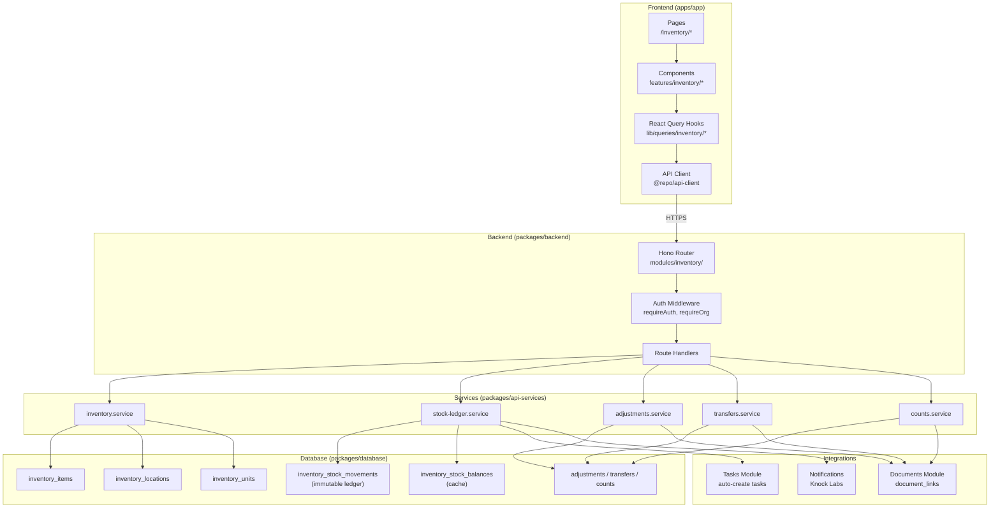
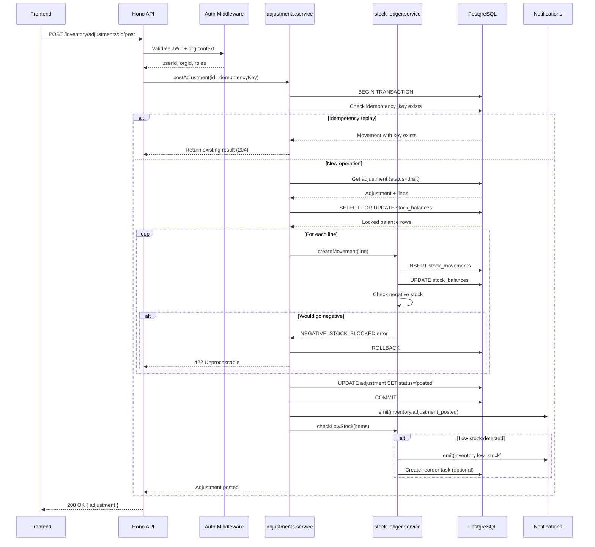

## High-Level Architecture

The Inventory Module follows Bumara's established architectural patterns:

```
┌─────────────────────────────────────────────────────────────────────────────┐
│                              FRONTEND                                        │
│                         (apps/app - Next.js)                                 │
├─────────────────────────────────────────────────────────────────────────────┤
│                                                                              │
│  ┌────────────────────────────────────────────────────────────────────┐     │
│  │                    React Components                                 │     │
│  │  /inventory/page.tsx (Dashboard)                                    │     │
│  │  /inventory/items/page.tsx (Items List)                            │     │
│  │  /inventory/stock/page.tsx (Stock Balances)                        │     │
│  │  /inventory/adjustments/page.tsx (Adjustments)                     │     │
│  │  ...                                                                │     │
│  └────────────────────────────────────────────────────────────────────┘     │
│                                │                                             │
│                                ▼                                             │
│  ┌────────────────────────────────────────────────────────────────────┐     │
│  │                React Query Hooks                                    │     │
│  │  lib/queries/inventory/hooks/use-items.ts                          │     │
│  │  lib/queries/inventory/hooks/use-stock.ts                          │     │
│  │  lib/queries/inventory/hooks/use-adjustments.ts                    │     │
│  │  ...                                                                │     │
│  └────────────────────────────────────────────────────────────────────┘     │
│                                │                                             │
│                                ▼                                             │
│  ┌────────────────────────────────────────────────────────────────────┐     │
│  │                    API Client                                       │     │
│  │  @repo/api-client (type-safe fetch with auth)                      │     │
│  └────────────────────────────────────────────────────────────────────┘     │
│                                                                              │
└─────────────────────────────────────────────────────────────────────────────┘
                                 │
                                 │ HTTPS
                                 ▼
┌─────────────────────────────────────────────────────────────────────────────┐
│                              BACKEND                                         │
│                   (packages/backend - Cloudflare Workers)                    │
├─────────────────────────────────────────────────────────────────────────────┤
│                                                                              │
│  ┌────────────────────────────────────────────────────────────────────┐     │
│  │                    Hono Router                                      │     │
│  │  modules/inventory/index.ts                                         │     │
│  │  ├── items/routes.ts + handlers.ts                                 │     │
│  │  ├── locations/routes.ts + handlers.ts                             │     │
│  │  ├── stock/routes.ts + handlers.ts                                 │     │
│  │  ├── adjustments/routes.ts + handlers.ts                           │     │
│  │  ├── transfers/routes.ts + handlers.ts                             │     │
│  │  └── counts/routes.ts + handlers.ts                                │     │
│  └────────────────────────────────────────────────────────────────────┘     │
│                                │                                             │
│                                ▼                                             │
│  ┌────────────────────────────────────────────────────────────────────┐     │
│  │                    Auth Middleware                                  │     │
│  │  core/middleware/auth.ts (Clerk + org context)                     │     │
│  │  requireAuth, requireOrg, requireRole                              │     │
│  └────────────────────────────────────────────────────────────────────┘     │
│                                                                              │
└─────────────────────────────────────────────────────────────────────────────┘
                                 │
                                 ▼
┌─────────────────────────────────────────────────────────────────────────────┐
│                           SERVICE LAYER                                      │
│                       (packages/api-services)                                │
├─────────────────────────────────────────────────────────────────────────────┤
│                                                                              │
│  ┌────────────────────────────────────────────────────────────────────┐     │
│  │                Domain Services                                      │     │
│  │  domains/inventory/inventory.service.ts                            │     │
│  │  domains/inventory/stock-ledger.service.ts                         │     │
│  │  domains/inventory/adjustments.service.ts                          │     │
│  │  domains/inventory/transfers.service.ts                            │     │
│  │  domains/inventory/counts.service.ts                               │     │
│  │  domains/inventory/uom.service.ts                                  │     │
│  └────────────────────────────────────────────────────────────────────┘     │
│                                │                                             │
│                                ▼                                             │
│  ┌────────────────────────────────────────────────────────────────────┐     │
│  │                Business Logic                                       │     │
│  │  - Ledger posting (immutable movements + balance updates)          │     │
│  │  - UoM conversion                                                   │     │
│  │  - Negative stock validation                                        │     │
│  │  - Idempotency enforcement                                          │     │
│  │  - Audit logging                                                    │     │
│  └────────────────────────────────────────────────────────────────────┘     │
│                                                                              │
└─────────────────────────────────────────────────────────────────────────────┘
                                 │
                                 ▼
┌─────────────────────────────────────────────────────────────────────────────┐
│                            DATABASE                                          │
│                        (packages/database)                                   │
├─────────────────────────────────────────────────────────────────────────────┤
│                                                                              │
│  ┌────────────────────────────────────────────────────────────────────┐     │
│  │                    Drizzle ORM                                      │     │
│  │  schema/inventory/                                                  │     │
│  │  ├── items.ts                                                      │     │
│  │  ├── categories.ts                                                 │     │
│  │  ├── locations.ts                                                  │     │
│  │  ├── units.ts                                                      │     │
│  │  ├── stock-movements.ts                                            │     │
│  │  ├── stock-balances.ts                                             │     │
│  │  ├── adjustments.ts                                                │     │
│  │  ├── transfers.ts                                                  │     │
│  │  ├── counts.ts                                                     │     │
│  │  └── index.ts (exports + relations)                                │     │
│  └────────────────────────────────────────────────────────────────────┘     │
│                                │                                             │
│                                ▼                                             │
│  ┌────────────────────────────────────────────────────────────────────┐     │
│  │                    PostgreSQL (Neon)                                │     │
│  │  Tables with org isolation, indexes, constraints                   │     │
│  └────────────────────────────────────────────────────────────────────┘     │
│                                                                              │
└─────────────────────────────────────────────────────────────────────────────┘
```

---

## Directory Structure (TO BE IMPLEMENTED)

### Database Schema

```
packages/database/src/schema/inventory/
├── items.ts                    # inventory_items table
├── categories.ts               # inventory_categories table
├── locations.ts                # inventory_locations table
├── units.ts                    # inventory_units + inventory_unit_conversions
├── stock-movements.ts          # inventory_stock_movements (ledger)
├── stock-balances.ts           # inventory_stock_balances (cache)
├── adjustments.ts              # inventory_adjustments + lines
├── transfers.ts                # inventory_transfers + lines
├── counts.ts                   # inventory_counts + lines
├── inventory-relations.ts      # Drizzle relations
└── index.ts                    # Barrel export
```

**Enum additions to `packages/database/src/schema/enums.ts`:**

```typescript
// Inventory enums
export const inventoryItemStatusEnum = pgEnum('inventory_item_status', ['active', 'archived']);
export const inventoryLocationTypeEnum = pgEnum('inventory_location_type', ['warehouse', 'store', 'van', 'other']);
export const inventoryMovementTypeEnum = pgEnum('inventory_movement_type', [
  'ADJUSTMENT_IN', 'ADJUSTMENT_OUT',
  'TRANSFER_OUT', 'TRANSFER_IN',
  'COUNT_VARIANCE_IN', 'COUNT_VARIANCE_OUT',
  'PURCHASE_RECEIPT', 'SALE_ISSUE' // Phase 2
]);
export const inventoryRefTypeEnum = pgEnum('inventory_ref_type', [
  'ADJUSTMENT', 'TRANSFER', 'COUNT', 'PURCHASE', 'SALE', 'OTHER'
]);
export const inventoryAdjustmentReasonEnum = pgEnum('inventory_adjustment_reason', [
  'DAMAGE', 'LOSS', 'FOUND', 'OPENING_BALANCE', 'CORRECTION', 'OTHER'
]);
export const inventoryAdjustmentStatusEnum = pgEnum('inventory_adjustment_status', ['draft', 'posted', 'void']);
export const inventoryTransferStatusEnum = pgEnum('inventory_transfer_status', ['draft', 'in_transit', 'received', 'void']);
export const inventoryCountTypeEnum = pgEnum('inventory_count_type', ['cycle', 'full']);
export const inventoryCountStatusEnum = pgEnum('inventory_count_status', ['draft', 'in_progress', 'completed', 'posted', 'void']);
```

### Backend Routes

```
packages/backend/src/modules/inventory/
├── index.ts                    # Router aggregation
├── items/
│   ├── routes.ts               # OpenAPI route definitions
│   └── handlers.ts             # Request handlers
├── locations/
│   ├── routes.ts
│   └── handlers.ts
├── units/
│   ├── routes.ts
│   └── handlers.ts
├── stock/
│   ├── routes.ts               # Balances + movements queries
│   └── handlers.ts
├── adjustments/
│   ├── routes.ts
│   └── handlers.ts
├── transfers/
│   ├── routes.ts
│   └── handlers.ts
└── counts/
    ├── routes.ts
    └── handlers.ts
```

**Router registration in `packages/backend/src/modules/index.ts`:**

```typescript
import { inventory } from './inventory';

export const router = createRouter()
  .route('/', subscriptions)
  .route('/', compliance)
  .route('/', catalog)
  .route('/', inventory); // Add inventory routes
```

### Service Layer

```
packages/inventory/src/
├── index.ts                    # Barrel export
├── inventory.service.ts        # Items CRUD
├── locations.service.ts        # Locations CRUD
├── uom.service.ts              # Units + conversions
├── stock-ledger.service.ts     # Movement posting, balance updates
├── adjustments.service.ts      # Adjustment operations
├── transfers.service.ts        # Transfer operations
├── counts.service.ts           # Count operations
├── inventory.schema.ts         # Zod schemas for validation
└── inventory.types.ts          # TypeScript types
```

### Frontend Pages

```
apps/app/app/(authenticated)/(modules)/inventory/
├── page.tsx                    # Dashboard
├── layout.tsx                  # Inventory layout with secondary sidebar
├── items/
│   ├── page.tsx                # Items list
│   └── [id]/
│       └── page.tsx            # Item detail
├── stock/
│   └── page.tsx                # Stock balances view
├── movements/
│   └── page.tsx                # Movements ledger
├── adjustments/
│   ├── page.tsx                # Adjustments list
│   ├── new/
│   │   └── page.tsx            # Create adjustment
│   └── [id]/
│       └── page.tsx            # Adjustment detail
├── transfers/
│   ├── page.tsx                # Transfers list
│   ├── new/
│   │   └── page.tsx            # Create transfer
│   └── [id]/
│       └── page.tsx            # Transfer detail
├── counts/
│   ├── page.tsx                # Counts list
│   ├── new/
│   │   └── page.tsx            # Create count
│   └── [id]/
│       └── page.tsx            # Count detail (with entry grid)
└── settings/
    └── page.tsx                # Locations, UoM settings
```

### React Query Hooks

```
apps/app/lib/queries/inventory/
├── fetchers/
│   ├── index.ts
│   ├── items.ts
│   ├── locations.ts
│   ├── stock.ts
│   ├── adjustments.ts
│   ├── transfers.ts
│   └── counts.ts
├── hooks/
│   ├── index.ts
│   ├── use-items.ts
│   ├── use-locations.ts
│   ├── use-stock.ts
│   ├── use-adjustments.ts
│   ├── use-transfers.ts
│   └── use-counts.ts
├── keys.ts                     # Query key factory
└── types.ts                    # TypeScript types
```

### Sidebar Configuration

```
apps/app/config/secondary-sidebar/inventory-sidebar.ts
```

```typescript
import type { NavGroupType } from '@/types/navigation.types';
import {
  LayoutDashboard,
  Package,
  Warehouse,
  ArrowLeftRight,
  ClipboardList,
  Settings,
  History,
} from 'lucide-react';

export const INVENTORY_MENU: NavGroupType[] = [
  {
    title: 'Overview',
    items: [
      { title: 'Dashboard', url: '/inventory', icon: LayoutDashboard },
    ],
  },
  {
    title: 'Stock',
    items: [
      { title: 'Items', url: '/inventory/items', icon: Package },
      { title: 'Stock Levels', url: '/inventory/stock', icon: Warehouse },
      { title: 'Movements', url: '/inventory/movements', icon: History },
    ],
  },
  {
    title: 'Operations',
    items: [
      { title: 'Adjustments', url: '/inventory/adjustments', icon: ClipboardList },
      { title: 'Transfers', url: '/inventory/transfers', icon: ArrowLeftRight },
      { title: 'Stock Counts', url: '/inventory/counts', icon: ClipboardList },
    ],
  },
  {
    title: 'Configuration',
    items: [
      { title: 'Settings', url: '/inventory/settings', icon: Settings },
    ],
  },
];
```

---

## Component Diagram



---

## Sequence Diagram: Post Stock Adjustment



---

## Integration Points

### Documents Module Integration

Reference: [`packages/database/src/schema/compliance/documents.ts`](https://github.com/bumara-dev/bumara/tree/main/packages/database/src/schema/compliance/documents.ts)

```typescript
// Extend document_links entity_type enum
export const documentLinksEntityTypeEnum = pgEnum('document_links_entity_type', [
  'filing',
  'service_request',
  'ticket',
  'payment_request',
  'regulator_payout',
  'inventory_adjustment',  // NEW
  'inventory_transfer',    // NEW
  'inventory_count',       // NEW
]);
```

**Usage pattern:**

```typescript
// In adjustments.service.ts
await db.insert(documentLinks).values({
  documentId: uploadedDoc.id,
  entityType: 'inventory_adjustment',
  entityId: adjustmentId,
  linkedBy: userId,
  linkedAt: new Date(),
});
```

### Tasks Module Integration

Reference: `packages/tasks/src/tasks/service.ts`

**Low stock task creation:**

```typescript
// In stock-ledger.service.ts
if (newBalance.onHandQty <= item.reorderLevel) {
  await createTask(ctx, deps, {
    organizationId: orgId,
    title: `Reorder Item: ${item.name}`,
    description: `Stock level (${newBalance.onHandQty}) is at or below reorder level (${item.reorderLevel})`,
    taskType: 'custom',
    required: false,
    // Link to item for navigation
    actionKind: 'navigate',
    actionRef: { href: `/inventory/items/${item.id}` },
  });
}
```

### Notifications Module Integration

Reference: [`packages/notifications/`](https://github.com/bumara-dev/bumara/tree/main/packages/notifications)

**Event emission:**

```typescript
// In stock-ledger.service.ts
import { notifications } from '@repo/notifications';

await notifications.workflows.trigger('inventory.low_stock', {
  recipients: [{ id: orgId }], // Org-level, routed to managers/admins
  data: {
    itemId: item.id,
    itemName: item.name,
    locationId: location.id,
    locationName: location.name,
    currentQty: newBalance.onHandQty,
    reorderLevel: item.reorderLevel,
  },
});
```

---

## Authentication & Authorization

Uses existing Clerk middleware from `packages/backend/src/core/middleware/auth.ts`.

**Route-level middleware:**

```typescript
// In routes.ts
export const postAdjustmentRoute = createRoute({
  tags: ['Inventory'],
  method: 'post',
  path: '/inventory/adjustments/:id/post',
  middleware: [requireAuth, requireOrg, requireRole(['manager', 'admin'])] as const,
  // ...
});
```

**Service-level permission check:**

```typescript
// In adjustments.service.ts
export async function postAdjustment(ctx: ServiceContext, deps: ServiceDeps, input: PostAdjustmentInput) {
  requireOrganizationContext(ctx); // Ensures org isolation
  
  // Check role for high-value adjustments
  if (adjustment.totalValue > APPROVAL_THRESHOLD) {
    if (!ctx.roles?.includes('admin')) {
      throw new ForbiddenError('Admin approval required for high-value adjustments');
    }
  }
  // ...
}
```

---

## Related Documentation

- [Data Model](/inventory/03-data-model) — Detailed schema definitions
- [API Spec](/inventory/04-api-spec) — Endpoint contracts
- [Workflows](/inventory/05-workflows) — Operation state machines

---

## Open Questions

1. **Cloudflare Durable Objects**: Should stock balance updates use Durable Objects for stronger consistency?
2. **Caching strategy**: Should we use Redis/KV for frequently-accessed balance queries?
3. **Batch operations**: Support bulk item creation/update in MVP?
4. **Webhook events**: Expose inventory events via Svix webhooks for external integrations?
