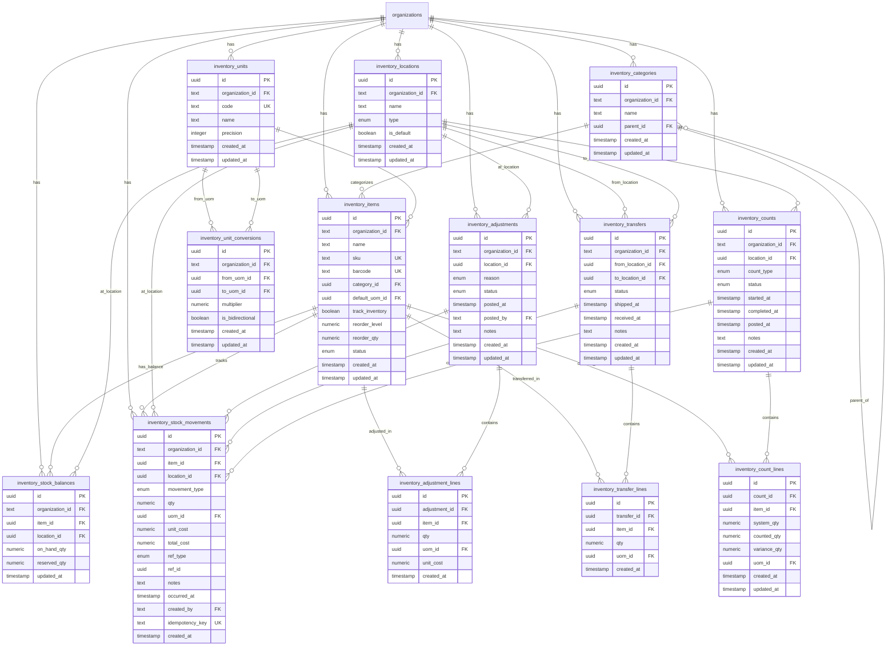

## Design Principles

### Ledger-First Architecture

The Inventory Module uses a **ledger-first** approach:

1. **`inventory_stock_movements`** is the immutable source of truth
2. **`inventory_stock_balances`** is a cached/derived table for performance
3. Balances are updated only through posting movements (no direct edits)
4. Every movement records who, when, what, and why

### Key Invariants

| Invariant | Enforcement |
|-----------|-------------|
| Organization isolation | All tables have `organization_id`, all queries scoped |
| Movement immutability | No UPDATE/DELETE on `stock_movements` (application-level) |
| Balance consistency | Transactions wrap movement + balance update |
| Idempotency | Unique `idempotency_key` per org prevents double-post |
| Referential integrity | Foreign keys with appropriate cascade behavior |

---

## Entity Relationship Diagram



---

## Table Definitions

### Core Tables

#### `inventory_items`

Products or materials tracked in inventory.

```typescript
// packages/database/src/schema/inventory/items.ts
import { pgTable, uuid, text, boolean, numeric, timestamp, index, unique } from 'drizzle-orm/pg-core';
import { organizations } from '../core/organizations';
import { inventoryItemStatusEnum } from '../enums';
import { timestamps } from '../../helpers/timestamps';

export const inventoryItems = pgTable(
  'inventory_items',
  {
    id: uuid('id').primaryKey().defaultRandom(),
    organizationId: text('organization_id')
      .notNull()
      .references(() => organizations.id, { onDelete: 'cascade' }),
    
    // Basic info
    name: text('name').notNull(),
    sku: text('sku'), // Stock Keeping Unit
    barcode: text('barcode'),
    description: text('description'),
    
    // Classification
    categoryId: uuid('category_id').references(() => inventoryCategories.id, { onDelete: 'set null' }),
    
    // Units
    defaultUomId: uuid('default_uom_id')
      .notNull()
      .references(() => inventoryUnits.id),
    
    // Tracking
    trackInventory: boolean('track_inventory').default(true).notNull(),
    
    // Reorder settings
    reorderLevel: numeric('reorder_level', { precision: 18, scale: 4 }),
    reorderQty: numeric('reorder_qty', { precision: 18, scale: 4 }),
    
    // Status
    status: inventoryItemStatusEnum('status').default('active').notNull(),
    
    ...timestamps,
  },
  (table) => [
    // Organization + status filtering
    index('idx_inventory_items_org_status').on(table.organizationId, table.status),
    // SKU uniqueness per org
    unique('uq_inventory_items_org_sku').on(table.organizationId, table.sku),
    // Barcode uniqueness per org
    unique('uq_inventory_items_org_barcode').on(table.organizationId, table.barcode),
    // Category filtering
    index('idx_inventory_items_category').on(table.organizationId, table.categoryId),
  ]
);

export type InventoryItem = typeof inventoryItems.$inferSelect;
export type NewInventoryItem = typeof inventoryItems.$inferInsert;
```

#### `inventory_categories`

Hierarchical categories for organizing items.

```typescript
// packages/database/src/schema/inventory/categories.ts
export const inventoryCategories = pgTable(
  'inventory_categories',
  {
    id: uuid('id').primaryKey().defaultRandom(),
    organizationId: text('organization_id')
      .notNull()
      .references(() => organizations.id, { onDelete: 'cascade' }),
    
    name: text('name').notNull(),
    parentId: uuid('parent_id').references(() => inventoryCategories.id, { onDelete: 'set null' }),
    
    ...timestamps,
  },
  (table) => [
    index('idx_inventory_categories_org').on(table.organizationId),
    index('idx_inventory_categories_parent').on(table.parentId),
    unique('uq_inventory_categories_org_name').on(table.organizationId, table.name),
  ]
);
```

#### `inventory_locations`

Physical places where stock is held.

```typescript
// packages/database/src/schema/inventory/locations.ts
export const inventoryLocations = pgTable(
  'inventory_locations',
  {
    id: uuid('id').primaryKey().defaultRandom(),
    organizationId: text('organization_id')
      .notNull()
      .references(() => organizations.id, { onDelete: 'cascade' }),
    
    name: text('name').notNull(),
    type: inventoryLocationTypeEnum('type').default('warehouse').notNull(),
    isDefault: boolean('is_default').default(false).notNull(),
    
    // Optional address fields
    address: text('address'),
    
    ...timestamps,
  },
  (table) => [
    index('idx_inventory_locations_org').on(table.organizationId),
    unique('uq_inventory_locations_org_name').on(table.organizationId, table.name),
  ]
);
```

#### `inventory_units`

Units of measure for counting/measuring items.

```typescript
// packages/database/src/schema/inventory/units.ts
export const inventoryUnits = pgTable(
  'inventory_units',
  {
    id: uuid('id').primaryKey().defaultRandom(),
    // organizationId is nullable for global/seeded units
    organizationId: text('organization_id')
      .references(() => organizations.id, { onDelete: 'cascade' }),
    
    code: text('code').notNull(), // EA, KG, L, BOX
    name: text('name').notNull(), // Each, Kilogram, Liter, Box
    precision: integer('precision').default(0).notNull(), // Decimal places: 0 for EA, 3 for KG
    
    ...timestamps,
  },
  (table) => [
    index('idx_inventory_units_org').on(table.organizationId),
    // Code uniqueness per org (or global if org is null)
    unique('uq_inventory_units_org_code').on(table.organizationId, table.code),
  ]
);
```

#### `inventory_unit_conversions`

Conversion factors between units (e.g., 1 BOX = 12 EA).

```typescript
// packages/database/src/schema/inventory/units.ts
export const inventoryUnitConversions = pgTable(
  'inventory_unit_conversions',
  {
    id: uuid('id').primaryKey().defaultRandom(),
    organizationId: text('organization_id')
      .references(() => organizations.id, { onDelete: 'cascade' }),
    
    fromUomId: uuid('from_uom_id')
      .notNull()
      .references(() => inventoryUnits.id, { onDelete: 'cascade' }),
    toUomId: uuid('to_uom_id')
      .notNull()
      .references(() => inventoryUnits.id, { onDelete: 'cascade' }),
    
    // Multiplier: 1 fromUom = multiplier toUom (e.g., 1 BOX = 12 EA → multiplier = 12)
    multiplier: numeric('multiplier', { precision: 18, scale: 8 }).notNull(),
    
    // If true, reverse conversion is also valid
    isBidirectional: boolean('is_bidirectional').default(true).notNull(),
    
    ...timestamps,
  },
  (table) => [
    index('idx_inventory_conversions_org').on(table.organizationId),
    // Prevent duplicate conversions
    unique('uq_inventory_conversions_pair').on(table.organizationId, table.fromUomId, table.toUomId),
  ]
);
```

### Ledger Tables

#### `inventory_stock_movements` (Immutable Ledger)

The source of truth for all stock changes.

```typescript
// packages/database/src/schema/inventory/stock-movements.ts
export const inventoryStockMovements = pgTable(
  'inventory_stock_movements',
  {
    id: uuid('id').primaryKey().defaultRandom(),
    organizationId: text('organization_id')
      .notNull()
      .references(() => organizations.id, { onDelete: 'cascade' }),
    
    // What changed
    itemId: uuid('item_id')
      .notNull()
      .references(() => inventoryItems.id, { onDelete: 'restrict' }),
    locationId: uuid('location_id')
      .notNull()
      .references(() => inventoryLocations.id, { onDelete: 'restrict' }),
    
    // Movement details
    movementType: inventoryMovementTypeEnum('movement_type').notNull(),
    qty: numeric('qty', { precision: 18, scale: 4 }).notNull(), // Signed quantity
    uomId: uuid('uom_id')
      .notNull()
      .references(() => inventoryUnits.id),
    
    // Costing (optional in MVP)
    unitCost: numeric('unit_cost', { precision: 18, scale: 4 }),
    totalCost: numeric('total_cost', { precision: 18, scale: 4 }),
    
    // Source reference
    refType: inventoryRefTypeEnum('ref_type').notNull(),
    refId: uuid('ref_id'), // Points to adjustment/transfer/count
    
    // Metadata
    notes: text('notes'),
    occurredAt: timestamp('occurred_at', { mode: 'date' }).notNull(), // Business date
    createdBy: text('created_by')
      .notNull()
      .references(() => users.id, { onDelete: 'set null' }),
    
    // Idempotency
    idempotencyKey: text('idempotency_key'),
    
    // Only created_at, no updated_at (immutable)
    createdAt: timestamp('created_at', { mode: 'date' }).notNull().defaultNow(),
  },
  (table) => [
    // Query patterns
    index('idx_stock_movements_org_occurred').on(table.organizationId, table.occurredAt),
    index('idx_stock_movements_item').on(table.organizationId, table.itemId, table.occurredAt),
    index('idx_stock_movements_location').on(table.organizationId, table.locationId, table.occurredAt),
    index('idx_stock_movements_ref').on(table.refType, table.refId),
    // Idempotency enforcement
    unique('uq_stock_movements_idempotency').on(table.organizationId, table.idempotencyKey),
  ]
);
```

#### `inventory_stock_balances` (Cache Table)

Derived/cached balances for fast queries.

```typescript
// packages/database/src/schema/inventory/stock-balances.ts
export const inventoryStockBalances = pgTable(
  'inventory_stock_balances',
  {
    id: uuid('id').primaryKey().defaultRandom(),
    organizationId: text('organization_id')
      .notNull()
      .references(() => organizations.id, { onDelete: 'cascade' }),
    
    itemId: uuid('item_id')
      .notNull()
      .references(() => inventoryItems.id, { onDelete: 'cascade' }),
    locationId: uuid('location_id')
      .notNull()
      .references(() => inventoryLocations.id, { onDelete: 'cascade' }),
    
    // Quantities (stored in item's base UoM)
    onHandQty: numeric('on_hand_qty', { precision: 18, scale: 4 }).default('0').notNull(),
    reservedQty: numeric('reserved_qty', { precision: 18, scale: 4 }).default('0').notNull(),
    // Available = onHand - reserved (computed or stored)
    
    // Last update timestamp
    updatedAt: timestamp('updated_at', { mode: 'date' }).notNull().defaultNow(),
  },
  (table) => [
    // One balance row per item+location
    unique('uq_stock_balances_item_location').on(table.organizationId, table.itemId, table.locationId),
    // Query patterns
    index('idx_stock_balances_org_item').on(table.organizationId, table.itemId),
    index('idx_stock_balances_org_location').on(table.organizationId, table.locationId),
  ]
);
```

### Operation Tables

#### `inventory_adjustments` + `inventory_adjustment_lines`

Stock adjustments (increase/decrease with reason).

```typescript
// packages/database/src/schema/inventory/adjustments.ts
export const inventoryAdjustments = pgTable(
  'inventory_adjustments',
  {
    id: uuid('id').primaryKey().defaultRandom(),
    organizationId: text('organization_id')
      .notNull()
      .references(() => organizations.id, { onDelete: 'cascade' }),
    
    locationId: uuid('location_id')
      .notNull()
      .references(() => inventoryLocations.id, { onDelete: 'restrict' }),
    
    reason: inventoryAdjustmentReasonEnum('reason').notNull(),
    status: inventoryAdjustmentStatusEnum('status').default('draft').notNull(),
    
    // Posting info
    postedAt: timestamp('posted_at', { mode: 'date' }),
    postedBy: text('posted_by').references(() => users.id, { onDelete: 'set null' }),
    
    // Void info
    voidedAt: timestamp('voided_at', { mode: 'date' }),
    voidedBy: text('voided_by').references(() => users.id, { onDelete: 'set null' }),
    voidReason: text('void_reason'),
    
    notes: text('notes'),
    
    ...timestamps,
  },
  (table) => [
    index('idx_adjustments_org_status').on(table.organizationId, table.status),
    index('idx_adjustments_org_location').on(table.organizationId, table.locationId),
  ]
);

export const inventoryAdjustmentLines = pgTable(
  'inventory_adjustment_lines',
  {
    id: uuid('id').primaryKey().defaultRandom(),
    adjustmentId: uuid('adjustment_id')
      .notNull()
      .references(() => inventoryAdjustments.id, { onDelete: 'cascade' }),
    
    itemId: uuid('item_id')
      .notNull()
      .references(() => inventoryItems.id, { onDelete: 'restrict' }),
    
    // Positive = increase, Negative = decrease
    qty: numeric('qty', { precision: 18, scale: 4 }).notNull(),
    uomId: uuid('uom_id')
      .notNull()
      .references(() => inventoryUnits.id),
    
    unitCost: numeric('unit_cost', { precision: 18, scale: 4 }),
    
    createdAt: timestamp('created_at', { mode: 'date' }).notNull().defaultNow(),
  },
  (table) => [
    index('idx_adjustment_lines_adjustment').on(table.adjustmentId),
    // Prevent duplicate items per adjustment
    unique('uq_adjustment_lines_item').on(table.adjustmentId, table.itemId),
  ]
);
```

#### `inventory_transfers` + `inventory_transfer_lines`

Stock transfers between locations.

```typescript
// packages/database/src/schema/inventory/transfers.ts
export const inventoryTransfers = pgTable(
  'inventory_transfers',
  {
    id: uuid('id').primaryKey().defaultRandom(),
    organizationId: text('organization_id')
      .notNull()
      .references(() => organizations.id, { onDelete: 'cascade' }),
    
    fromLocationId: uuid('from_location_id')
      .notNull()
      .references(() => inventoryLocations.id, { onDelete: 'restrict' }),
    toLocationId: uuid('to_location_id')
      .notNull()
      .references(() => inventoryLocations.id, { onDelete: 'restrict' }),
    
    status: inventoryTransferStatusEnum('status').default('draft').notNull(),
    
    // Shipping info
    shippedAt: timestamp('shipped_at', { mode: 'date' }),
    shippedBy: text('shipped_by').references(() => users.id, { onDelete: 'set null' }),
    
    // Receiving info
    receivedAt: timestamp('received_at', { mode: 'date' }),
    receivedBy: text('received_by').references(() => users.id, { onDelete: 'set null' }),
    
    // Void info
    voidedAt: timestamp('voided_at', { mode: 'date' }),
    voidedBy: text('voided_by').references(() => users.id, { onDelete: 'set null' }),
    voidReason: text('void_reason'),
    
    notes: text('notes'),
    
    ...timestamps,
  },
  (table) => [
    index('idx_transfers_org_status').on(table.organizationId, table.status),
    index('idx_transfers_from_location').on(table.organizationId, table.fromLocationId),
    index('idx_transfers_to_location').on(table.organizationId, table.toLocationId),
  ]
);

export const inventoryTransferLines = pgTable(
  'inventory_transfer_lines',
  {
    id: uuid('id').primaryKey().defaultRandom(),
    transferId: uuid('transfer_id')
      .notNull()
      .references(() => inventoryTransfers.id, { onDelete: 'cascade' }),
    
    itemId: uuid('item_id')
      .notNull()
      .references(() => inventoryItems.id, { onDelete: 'restrict' }),
    
    qty: numeric('qty', { precision: 18, scale: 4 }).notNull(),
    uomId: uuid('uom_id')
      .notNull()
      .references(() => inventoryUnits.id),
    
    createdAt: timestamp('created_at', { mode: 'date' }).notNull().defaultNow(),
  },
  (table) => [
    index('idx_transfer_lines_transfer').on(table.transferId),
    unique('uq_transfer_lines_item').on(table.transferId, table.itemId),
  ]
);
```

#### `inventory_counts` + `inventory_count_lines`

Stock counts with variance tracking.

```typescript
// packages/database/src/schema/inventory/counts.ts
export const inventoryCounts = pgTable(
  'inventory_counts',
  {
    id: uuid('id').primaryKey().defaultRandom(),
    organizationId: text('organization_id')
      .notNull()
      .references(() => organizations.id, { onDelete: 'cascade' }),
    
    locationId: uuid('location_id')
      .notNull()
      .references(() => inventoryLocations.id, { onDelete: 'restrict' }),
    
    countType: inventoryCountTypeEnum('count_type').default('cycle').notNull(),
    status: inventoryCountStatusEnum('status').default('draft').notNull(),
    
    // Progress timestamps
    startedAt: timestamp('started_at', { mode: 'date' }),
    completedAt: timestamp('completed_at', { mode: 'date' }),
    postedAt: timestamp('posted_at', { mode: 'date' }),
    postedBy: text('posted_by').references(() => users.id, { onDelete: 'set null' }),
    
    // Void info
    voidedAt: timestamp('voided_at', { mode: 'date' }),
    voidedBy: text('voided_by').references(() => users.id, { onDelete: 'set null' }),
    voidReason: text('void_reason'),
    
    notes: text('notes'),
    
    ...timestamps,
  },
  (table) => [
    index('idx_counts_org_status').on(table.organizationId, table.status),
    index('idx_counts_org_location').on(table.organizationId, table.locationId),
  ]
);

export const inventoryCountLines = pgTable(
  'inventory_count_lines',
  {
    id: uuid('id').primaryKey().defaultRandom(),
    countId: uuid('count_id')
      .notNull()
      .references(() => inventoryCounts.id, { onDelete: 'cascade' }),
    
    itemId: uuid('item_id')
      .notNull()
      .references(() => inventoryItems.id, { onDelete: 'restrict' }),
    
    // Snapshot at count start or finalize
    systemQty: numeric('system_qty', { precision: 18, scale: 4 }).notNull(),
    
    // User-entered count
    countedQty: numeric('counted_qty', { precision: 18, scale: 4 }),
    
    // Calculated: counted - system
    varianceQty: numeric('variance_qty', { precision: 18, scale: 4 }),
    
    uomId: uuid('uom_id')
      .notNull()
      .references(() => inventoryUnits.id),
    
    ...timestamps,
  },
  (table) => [
    index('idx_count_lines_count').on(table.countId),
    unique('uq_count_lines_item').on(table.countId, table.itemId),
  ]
);
```

---

## Enum Definitions

Add to `packages/database/src/schema/enums.ts`:

```typescript
// Inventory Item Status
export const inventoryItemStatusEnum = pgEnum('inventory_item_status', [
  'active',
  'archived',
]);

// Location Type
export const inventoryLocationTypeEnum = pgEnum('inventory_location_type', [
  'warehouse',
  'store',
  'van',
  'other',
]);

// Movement Type
export const inventoryMovementTypeEnum = pgEnum('inventory_movement_type', [
  'ADJUSTMENT_IN',
  'ADJUSTMENT_OUT',
  'TRANSFER_OUT',
  'TRANSFER_IN',
  'COUNT_VARIANCE_IN',
  'COUNT_VARIANCE_OUT',
  'PURCHASE_RECEIPT',  // Phase 2
  'SALE_ISSUE',        // Phase 2
]);

// Reference Type (source of movement)
export const inventoryRefTypeEnum = pgEnum('inventory_ref_type', [
  'ADJUSTMENT',
  'TRANSFER',
  'COUNT',
  'PURCHASE',  // Phase 2
  'SALE',      // Phase 2
  'OTHER',
]);

// Adjustment Reason
export const inventoryAdjustmentReasonEnum = pgEnum('inventory_adjustment_reason', [
  'DAMAGE',
  'LOSS',
  'FOUND',
  'OPENING_BALANCE',
  'CORRECTION',
  'OTHER',
]);

// Adjustment Status
export const inventoryAdjustmentStatusEnum = pgEnum('inventory_adjustment_status', [
  'draft',
  'posted',
  'void',
]);

// Transfer Status
export const inventoryTransferStatusEnum = pgEnum('inventory_transfer_status', [
  'draft',
  'in_transit',
  'received',
  'void',
]);

// Count Type
export const inventoryCountTypeEnum = pgEnum('inventory_count_type', [
  'cycle',
  'full',
]);

// Count Status
export const inventoryCountStatusEnum = pgEnum('inventory_count_status', [
  'draft',
  'in_progress',
  'completed',
  'posted',
  'void',
]);
```

---

## Numeric Precision Strategy

**Problem:** Floating-point numbers cause rounding errors in financial/quantity calculations.

**Solution:** Use PostgreSQL `NUMERIC` type with explicit precision:

| Use Case | Precision | Scale | Example |
|----------|-----------|-------|---------|
| Quantity | 18 | 4 | `1234567890123456.1234` |
| Unit Cost | 18 | 4 | `99999999999999.9999` |
| Total Cost | 18 | 4 | Same |
| UoM Multiplier | 18 | 8 | `0.00000001` for micro-conversions |

**Drizzle definition:**

```typescript
qty: numeric('qty', { precision: 18, scale: 4 }).notNull()
```

**Application layer:**

```typescript
// Use Decimal.js or similar for calculations
import Decimal from 'decimal.js';

const qtyInBase = new Decimal(qtyInOther).times(conversion.multiplier);
```

---

## Concurrency Strategy

### Problem

Multiple users posting transactions simultaneously could corrupt balance data.

### Solution: Pessimistic Locking

Use `SELECT ... FOR UPDATE` to lock balance rows during posting:

```typescript
// In stock-ledger.service.ts
async function postMovements(
  ctx: ServiceContext,
  deps: ServiceDeps,
  movements: MovementInput[]
): Promise<void> {
  const { db } = deps;
  
  await db.transaction(async (tx) => {
    // 1. Lock relevant balance rows
    const itemLocationPairs = movements.map(m => ({ itemId: m.itemId, locationId: m.locationId }));
    
    for (const pair of itemLocationPairs) {
      await tx.execute(sql`
        SELECT * FROM inventory_stock_balances
        WHERE organization_id = ${ctx.orgId}
          AND item_id = ${pair.itemId}
          AND location_id = ${pair.locationId}
        FOR UPDATE
      `);
    }
    
    // 2. Insert movements
    for (const movement of movements) {
      await tx.insert(inventoryStockMovements).values({
        organizationId: ctx.orgId,
        itemId: movement.itemId,
        locationId: movement.locationId,
        movementType: movement.type,
        qty: movement.qty,
        uomId: movement.uomId,
        refType: movement.refType,
        refId: movement.refId,
        occurredAt: new Date(),
        createdBy: ctx.userId,
        idempotencyKey: movement.idempotencyKey,
      });
    }
    
    // 3. Update balances
    for (const movement of movements) {
      await tx
        .update(inventoryStockBalances)
        .set({
          onHandQty: sql`on_hand_qty + ${movement.qty}`,
          updatedAt: new Date(),
        })
        .where(
          and(
            eq(inventoryStockBalances.organizationId, ctx.orgId),
            eq(inventoryStockBalances.itemId, movement.itemId),
            eq(inventoryStockBalances.locationId, movement.locationId),
          )
        );
    }
    
    // 4. Check negative stock constraint
    const negativeBalances = await tx
      .select()
      .from(inventoryStockBalances)
      .where(
        and(
          eq(inventoryStockBalances.organizationId, ctx.orgId),
          lt(inventoryStockBalances.onHandQty, sql`0`),
        )
      );
    
    if (negativeBalances.length > 0 && !ctx.allowNegativeStock) {
      throw new BusinessError('NEGATIVE_STOCK_BLOCKED', 'Operation would result in negative stock');
    }
  });
}
```

### Alternative: Optimistic Locking

Use a `version` column and retry on conflict:

```typescript
// Alternative approach (not recommended for MVP due to complexity)
version: integer('version').default(1).notNull(),

// Update with version check
const result = await tx
  .update(inventoryStockBalances)
  .set({
    onHandQty: sql`on_hand_qty + ${qty}`,
    version: sql`version + 1`,
  })
  .where(
    and(
      eq(inventoryStockBalances.id, balance.id),
      eq(inventoryStockBalances.version, balance.version),
    )
  );

if (result.rowCount === 0) {
  throw new ConcurrencyError('Balance was modified by another transaction');
}
```

**Recommendation:** Use pessimistic locking (`SELECT FOR UPDATE`) for MVP simplicity.

---

## Index Strategy

### Query Patterns and Indexes

| Query Pattern | Index |
|---------------|-------|
| List items by org + status | `idx_inventory_items_org_status` |
| List movements by date range | `idx_stock_movements_org_occurred` |
| Get movements for item | `idx_stock_movements_item` |
| Get balance for item + location | `uq_stock_balances_item_location` |
| Check idempotency | `uq_stock_movements_idempotency` |
| List adjustments by status | `idx_adjustments_org_status` |

### Partial Indexes (Optional)

For better performance on common queries:

```sql
-- Only active items (most queries filter by status)
CREATE INDEX idx_inventory_items_active 
ON inventory_items (organization_id, name) 
WHERE status = 'active';

-- Only draft operations (frequently edited)
CREATE INDEX idx_adjustments_draft 
ON inventory_adjustments (organization_id, updated_at) 
WHERE status = 'draft';
```

---

## Seed Data

### Default Units of Measure

```typescript
// packages/database/src/seeds/seed-inventory-units.ts
const defaultUnits = [
  { code: 'EA', name: 'Each', precision: 0 },
  { code: 'BOX', name: 'Box', precision: 0 },
  { code: 'PACK', name: 'Pack', precision: 0 },
  { code: 'KG', name: 'Kilogram', precision: 3 },
  { code: 'G', name: 'Gram', precision: 0 },
  { code: 'L', name: 'Liter', precision: 3 },
  { code: 'ML', name: 'Milliliter', precision: 0 },
  { code: 'M', name: 'Meter', precision: 2 },
];

// Insert with organizationId = null for global units
await db.insert(inventoryUnits).values(
  defaultUnits.map(u => ({ ...u, organizationId: null }))
);
```

---

## Related Documentation

- [Overview](/inventory/01-overview) — Goals and terminology
- [Architecture](/inventory/02-architecture) — System design
- [API Spec](/inventory/04-api-spec) — Endpoint contracts
- [Workflows](/inventory/05-workflows) — Operation state machines

---

## Open Questions

1. **Balance initialization**: Create balance rows on-demand (first movement) or pre-create for all item+location combinations?
2. **Historical balances**: Should we support point-in-time balance queries (requires balance snapshots)?
3. **Soft delete for items**: Archive vs. hard delete? Current design uses archive status.
4. **UoM conversion precision**: Is 8 decimal places enough for all conversions?
5. **Multi-location transfers**: Support transfers involving 3+ locations (hub-and-spoke)?
