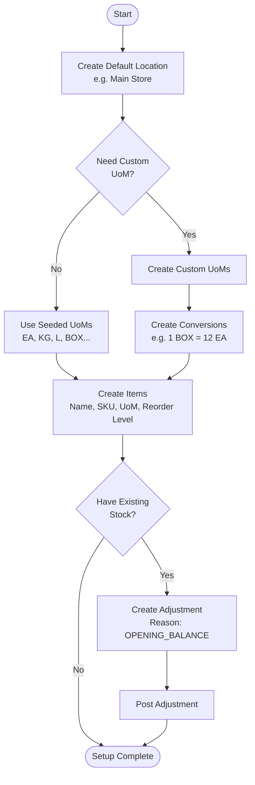
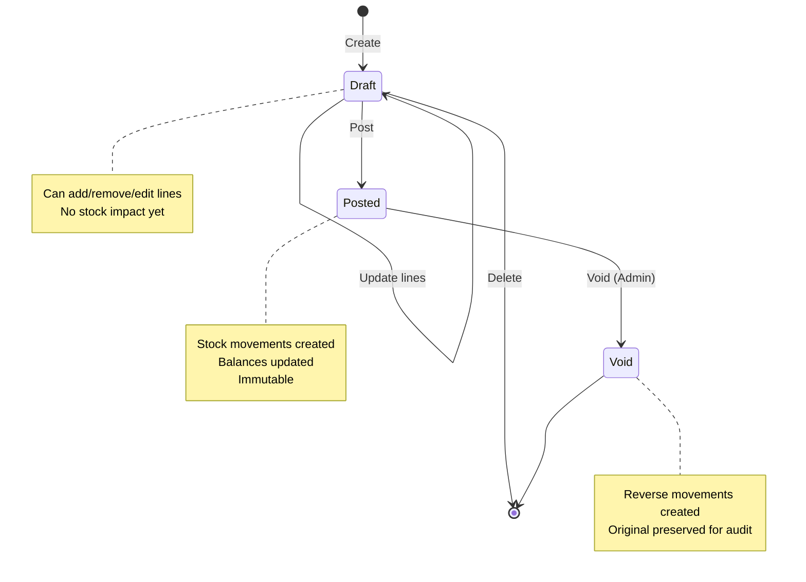
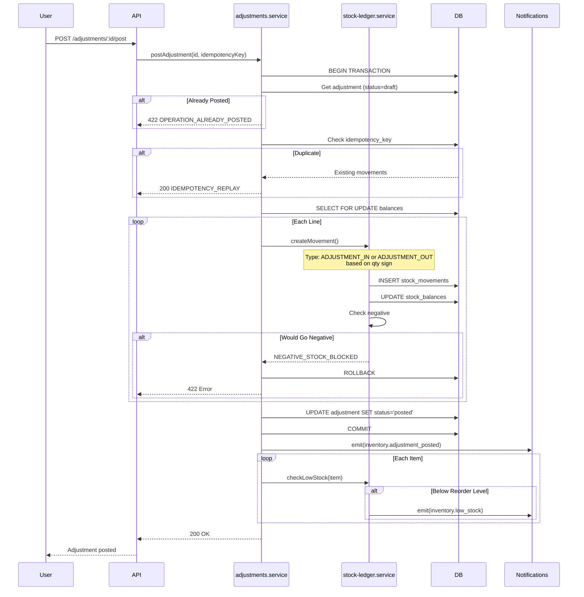
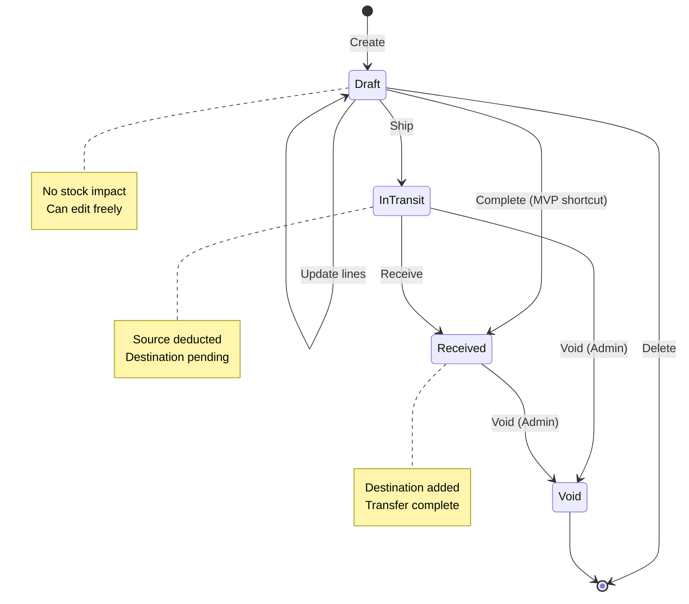
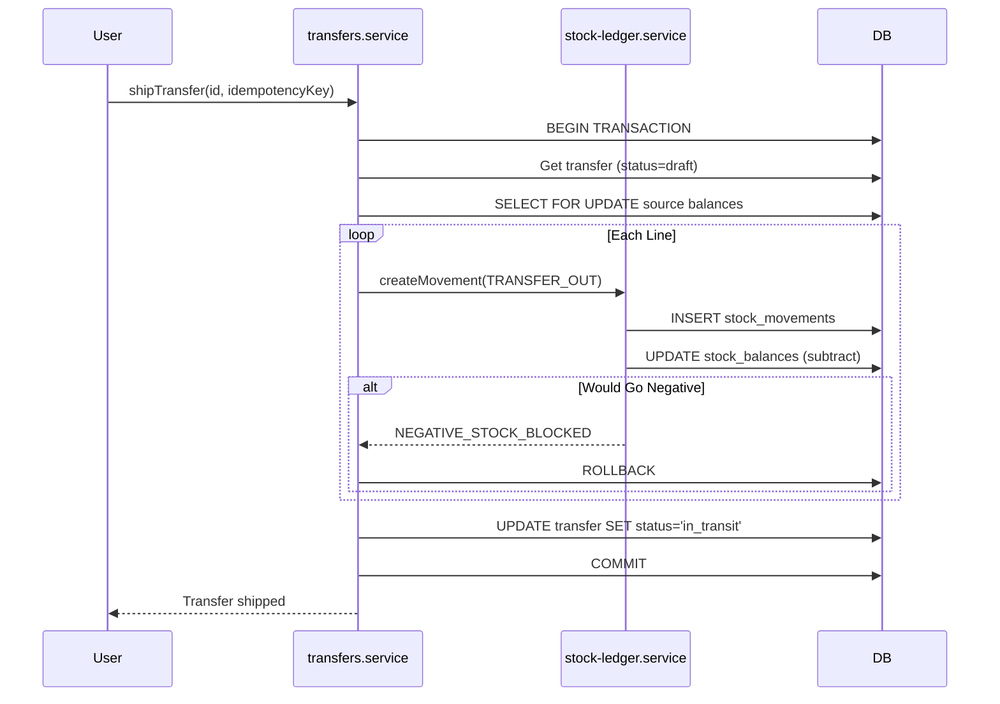
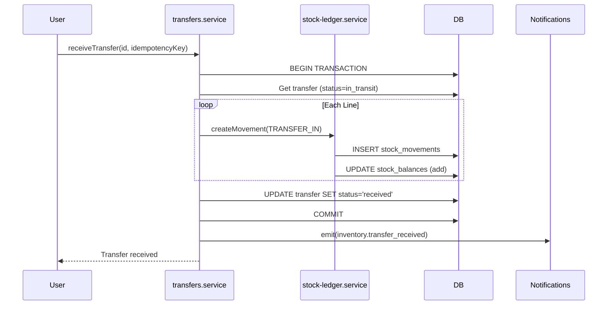
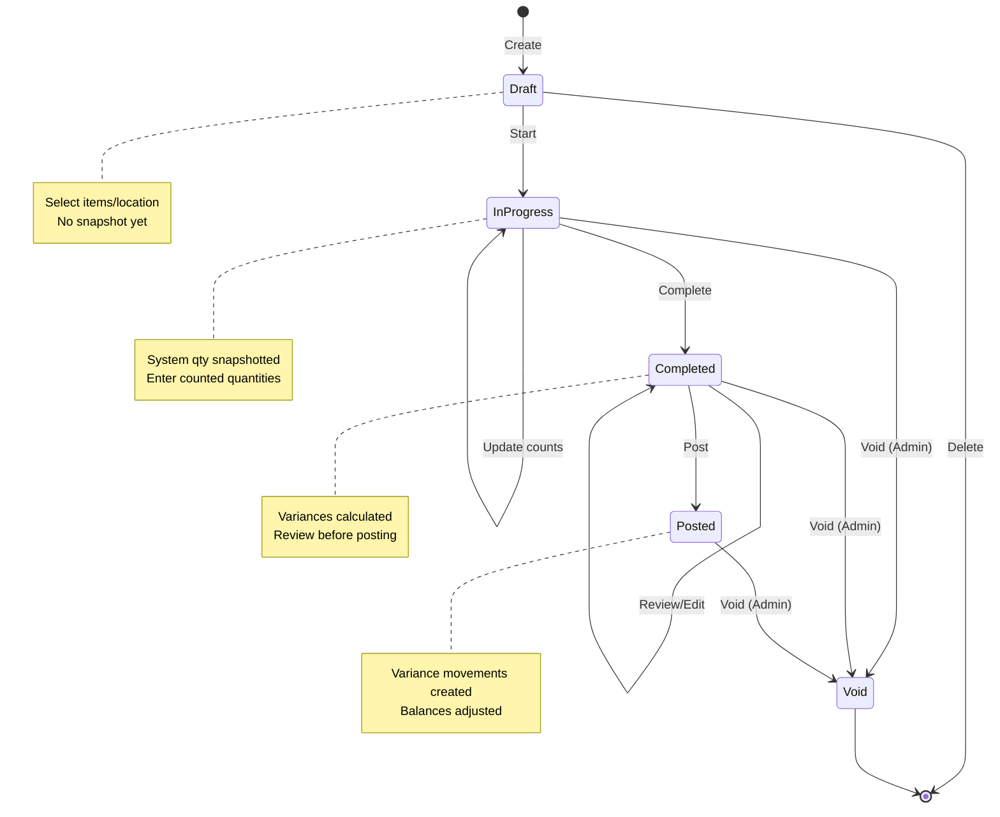
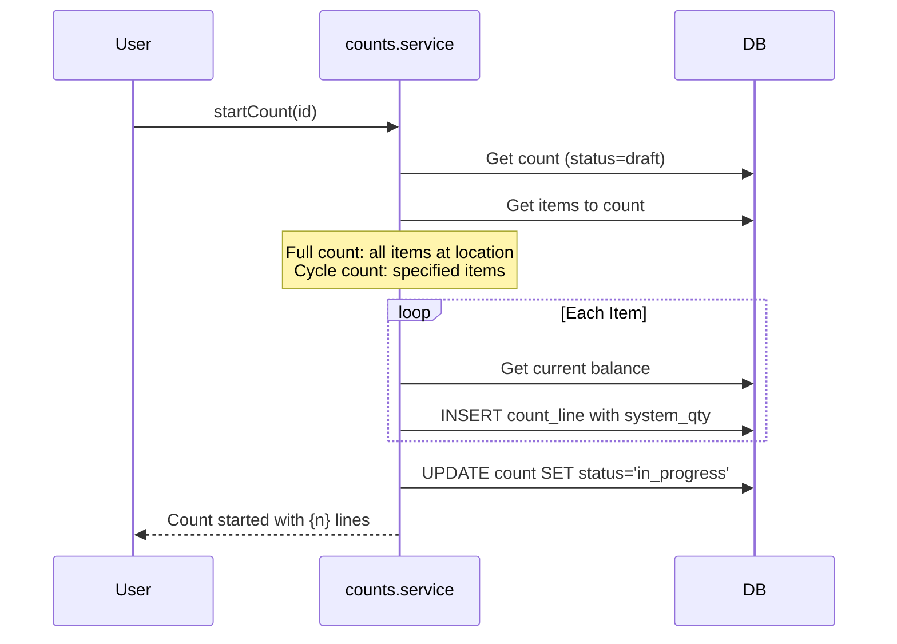
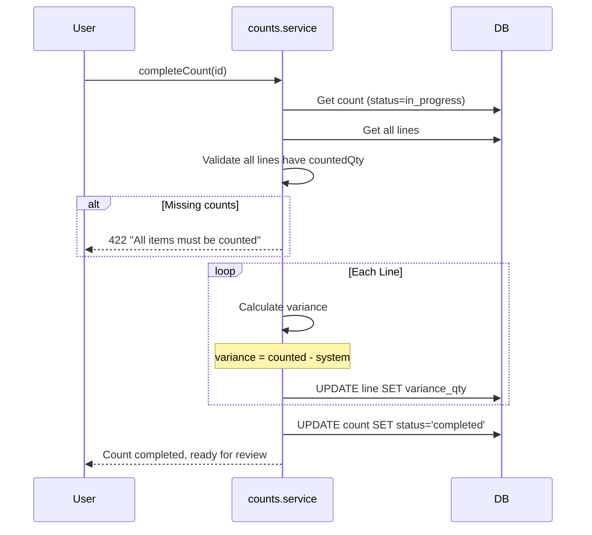
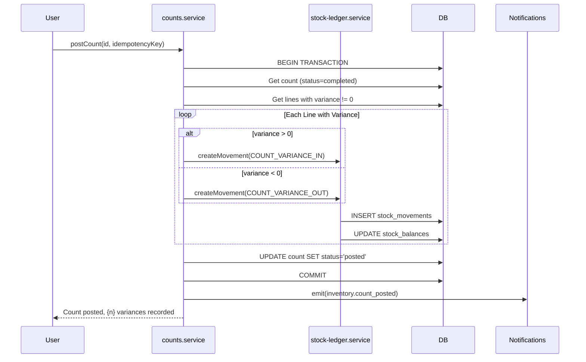

## Overview

The Inventory Module has four main workflows:

1. **Setup Flow** — Initial configuration (locations, UoM, items, opening balance)
2. **Stock Adjustment** — Increase/decrease stock with reason
3. **Stock Transfer** — Move stock between locations
4. **Stock Count** — Physical count with variance posting

Each workflow follows a draft → action → posted pattern with audit trails.

---

## 1. Setup Flow (First-Run)

### Purpose

Configure the organization's inventory foundation before tracking stock.

### Steps



### Database Writes

| Step | Tables Affected |
|------|-----------------|
| Create Location | `inventory_locations` |
| Create UoM | `inventory_units` |
| Create Conversion | `inventory_unit_conversions` |
| Create Item | `inventory_items` |
| Post Opening Balance | `inventory_adjustments`, `inventory_adjustment_lines`, `inventory_stock_movements`, `inventory_stock_balances` |

### Audit Requirements

- All creates logged in general audit log
- Opening balance adjustment has full movement history

### Edge Cases

| Scenario | Handling |
|----------|----------|
| No default location | First location created is set as default |
| Duplicate UoM code | Reject with `DUPLICATE_UOM_CODE` error |
| Duplicate SKU | Reject with `DUPLICATE_SKU` error |
| Opening balance for non-existent item | Validate item exists before posting |

---

## 2. Stock Adjustment Workflow

### Purpose

Increase or decrease stock quantities with a documented reason.

### State Machine



### Status Transitions

| From | To | Action | Auth | Validation |
|------|-----|--------|------|------------|
| - | `draft` | Create | Manager+ | Location exists |
| `draft` | `draft` | Update | Manager+ | - |
| `draft` | `posted` | Post | Manager+ | Lines exist, items active, negative stock check |
| `draft` | - | Delete | Manager+ | - |
| `posted` | `void` | Void | Admin | Reason required |

### Post Adjustment Flow



### Database Writes (Post)

```typescript
// 1. Create movements (one per line)
INSERT INTO inventory_stock_movements (
  organization_id, item_id, location_id,
  movement_type, qty, uom_id,
  ref_type, ref_id, notes,
  occurred_at, created_by, idempotency_key
) VALUES (
  $orgId, $itemId, $locationId,
  'ADJUSTMENT_IN', -- or 'ADJUSTMENT_OUT' if qty < 0
  abs($qty), $uomId,
  'ADJUSTMENT', $adjustmentId, $notes,
  NOW(), $userId, $idempotencyKey
);

// 2. Update balance (upsert pattern)
INSERT INTO inventory_stock_balances (
  organization_id, item_id, location_id, on_hand_qty
) VALUES ($orgId, $itemId, $locationId, $qty)
ON CONFLICT (organization_id, item_id, location_id)
DO UPDATE SET
  on_hand_qty = inventory_stock_balances.on_hand_qty + EXCLUDED.on_hand_qty,
  updated_at = NOW();

// 3. Update adjustment status
UPDATE inventory_adjustments
SET status = 'posted', posted_at = NOW(), posted_by = $userId
WHERE id = $adjustmentId;
```

### Events Emitted

| Event | When | Payload |
|-------|------|---------|
| `inventory.adjustment_posted` | After commit | `{ adjustmentId, locationId, reason, lineCount, userId }` |
| `inventory.low_stock` | If balance &lt;= reorder level | `{ itemId, locationId, currentQty, reorderLevel }` |

### Edge Cases

| Scenario | Handling |
|----------|----------|
| Empty lines | Reject: "Adjustment must have at least one line" |
| Zero quantity line | Reject: "Line quantity cannot be zero" |
| Archived item | Reject: "Cannot adjust archived item" |
| Negative stock (blocked) | Reject: `NEGATIVE_STOCK_BLOCKED` |
| Negative stock (allowed) | Post with warning event |
| Network retry | Idempotency key returns original result |
| Concurrent posts | Transaction isolation prevents double-post |

---

## 3. Stock Transfer Workflow

### Purpose

Move stock from one location to another, with optional in-transit state.

### State Machine



### Status Transitions

| From | To | Action | Auth | Validation |
|------|-----|--------|------|------------|
| - | `draft` | Create | Manager+ | Both locations exist, different locations |
| `draft` | `draft` | Update | Manager+ | - |
| `draft` | `in_transit` | Ship | Manager+ | Lines exist, source has stock |
| `draft` | `received` | Complete | Manager+ | Combines ship + receive |
| `in_transit` | `received` | Receive | Manager+ | - |
| `in_transit` | `void` | Void | Admin | Returns stock to source |
| `received` | `void` | Void | Admin | Reverses both movements |

### Ship Flow



### Receive Flow



### Complete (MVP Shortcut)

For MVP, support a single "Complete" action that does ship + receive atomically:

```typescript
// In transfers.service.ts
async function completeTransfer(ctx, deps, id, idempotencyKey) {
  await db.transaction(async (tx) => {
    // Ship: TRANSFER_OUT at source
    for (const line of transfer.lines) {
      await createMovement(tx, {
        movementType: 'TRANSFER_OUT',
        locationId: transfer.fromLocationId,
        qty: -line.qty, // Negative to subtract
        refType: 'TRANSFER',
        refId: id,
      });
    }
    
    // Receive: TRANSFER_IN at destination
    for (const line of transfer.lines) {
      await createMovement(tx, {
        movementType: 'TRANSFER_IN',
        locationId: transfer.toLocationId,
        qty: line.qty, // Positive to add
        refType: 'TRANSFER',
        refId: id,
      });
    }
    
    // Update status directly to received
    await tx.update(inventoryTransfers)
      .set({ status: 'received', receivedAt: new Date() })
      .where(eq(inventoryTransfers.id, id));
  });
}
```

### Events Emitted

| Event | When | Payload |
|-------|------|---------|
| `inventory.transfer_shipped` | After ship | `{ transferId, fromLocationId, lineCount }` |
| `inventory.transfer_received` | After receive | `{ transferId, toLocationId, lineCount }` |
| `inventory.low_stock` | If source balance &lt;= reorder | `{ itemId, locationId, ... }` |

### Edge Cases

| Scenario | Handling |
|----------|----------|
| Same source/destination | Reject at creation |
| Source has insufficient stock | Reject ship with `NEGATIVE_STOCK_BLOCKED` |
| Void in-transit transfer | Return stock to source via TRANSFER_IN |
| Void received transfer | Create reverse movements at both locations |

---

## 4. Stock Count Workflow

### Purpose

Compare physical inventory to system records and post variances.

### State Machine



### Status Transitions

| From | To | Action | Auth | Validation |
|------|-----|--------|------|------------|
| - | `draft` | Create | Manager+ | Location exists |
| `draft` | `in_progress` | Start | Manager+ | Creates lines, snapshots system qty |
| `draft` | - | Delete | Manager+ | - |
| `in_progress` | `in_progress` | Update | Manager+ | Enter counted quantities |
| `in_progress` | `completed` | Complete | Manager+ | All lines have counted qty |
| `in_progress` | `void` | Void | Admin | - |
| `completed` | `completed` | Edit | Manager+ | Adjust counted qty |
| `completed` | `posted` | Post | Manager+ | - |
| `completed` | `void` | Void | Admin | - |
| `posted` | `void` | Void | Admin | Reverses variance movements |

### Start Count Flow



### Update Count Lines

```typescript
// PATCH /counts/:id/lines
// User enters physical counts
for (const update of input.lines) {
  await db.update(inventoryCountLines)
    .set({
      countedQty: update.countedQty,
      // Variance calculated on complete
      updatedAt: new Date(),
    })
    .where(
      and(
        eq(inventoryCountLines.countId, countId),
        eq(inventoryCountLines.itemId, update.itemId),
      )
    );
}
```

### Complete Count Flow



### Post Count Flow



### Database Writes (Post)

```sql
-- For each line with variance
INSERT INTO inventory_stock_movements (
  organization_id, item_id, location_id,
  movement_type, qty, uom_id,
  ref_type, ref_id, notes,
  occurred_at, created_by, idempotency_key
) VALUES (
  $orgId, $itemId, $locationId,
  CASE WHEN $variance > 0 THEN 'COUNT_VARIANCE_IN' ELSE 'COUNT_VARIANCE_OUT' END,
  abs($variance), $uomId,
  'COUNT', $countId, 'Stock count variance',
  NOW(), $userId, $idempotencyKey || '-' || $itemId
);

-- Balance is updated to exactly match counted qty
UPDATE inventory_stock_balances
SET on_hand_qty = $countedQty, updated_at = NOW()
WHERE organization_id = $orgId
  AND item_id = $itemId
  AND location_id = $locationId;
```

### Events Emitted

| Event | When | Payload |
|-------|------|---------|
| `inventory.count_started` | After start | `{ countId, locationId, lineCount }` |
| `inventory.count_posted` | After post | `{ countId, locationId, varianceCount, totalVarianceQty }` |

### Edge Cases

| Scenario | Handling |
|----------|----------|
| Item added to location during count | Re-snapshot or warn user |
| Item removed during count | Line shows as "not counted" |
| Zero variance | No movement created for that line |
| Void after post | Creates reverse variance movements |
| Concurrent counts at same location | Allow but warn (best practice: one at a time) |

---

## Negative Stock Policy

### Default Behavior (MVP)

Block operations that would result in negative stock.

### Configuration (Future)

```typescript
// Organization-level setting
interface InventorySettings {
  allowNegativeStock: boolean; // default: false
  negativeStockAlertThreshold: number; // For warnings
}
```

### Override (Admin)

Admins can override blocks with documented reason:

```typescript
const postAdjustmentInputSchema = z.object({
  idempotencyKey: z.string().uuid(),
  overrideNegativeStock: z.boolean().optional(),
  overrideReason: z.string().max(500).optional(),
});

// In service
if (wouldGoNegative && !ctx.allowNegativeStock) {
  if (input.overrideNegativeStock && ctx.roles?.includes('admin')) {
    // Allow but log warning
    await emitEvent('inventory.negative_stock_override', {
      itemId, locationId, reason: input.overrideReason,
    });
  } else {
    throw new BusinessError('NEGATIVE_STOCK_BLOCKED');
  }
}
```

---

## Audit Trail Requirements

### What Gets Logged

| Action | Logged Data |
|--------|-------------|
| Create adjustment | adjustmentId, locationId, reason, userId, timestamp |
| Post adjustment | adjustmentId, movements[], userId, timestamp |
| Void adjustment | adjustmentId, voidReason, userId, timestamp |
| Ship transfer | transferId, fromLocationId, userId, timestamp |
| Receive transfer | transferId, toLocationId, userId, timestamp |
| Start count | countId, locationId, lineCount, userId, timestamp |
| Post count | countId, variances[], userId, timestamp |

### Immutability

- Stock movements are never updated or deleted
- Corrections are made via new operations (adjustments, voids)
- All operations have `created_by` and `created_at`

### Queryable History

```sql
-- Get complete history for an item
SELECT * FROM inventory_stock_movements
WHERE organization_id = $orgId
  AND item_id = $itemId
ORDER BY occurred_at DESC;

-- Reconstruct balance at any point in time
SELECT SUM(qty) as balance_at_date
FROM inventory_stock_movements
WHERE organization_id = $orgId
  AND item_id = $itemId
  AND location_id = $locationId
  AND occurred_at <= $targetDate;
```

---

## Related Documentation

- [Data Model](/inventory/03-data-model) — Database schema
- [API Spec](/inventory/04-api-spec) — Endpoint contracts
- [Events](/inventory/07-events-notifications) — Event catalog

---

## Open Questions

1. **Partial receives**: Should transfers support receiving partial quantities?
2. **Count freeze**: Should we prevent other operations at a location during active count?
3. **Approval workflow**: Should high-value variances require manager approval before posting?
4. **Scheduled counts**: Support for recurring/scheduled stock counts?
