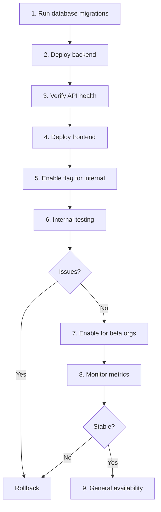

## Overview

The Inventory Module rollout follows Bumara's standard deployment practices:

1. **Database-first**: Deploy schema before application code
2. **Feature-flagged**: Hide UI until ready for users
3. **Phased rollout**: Internal testing → Beta orgs → General availability
4. **Observable**: Logs, metrics, and alerts from day one

---

## Migration Plan

### Phase 1: Schema Deployment

Deploy database tables without application changes.

#### Migration Files

```
packages/database/drizzle/
├── 0040_inventory_core.sql           # Core tables
├── 0041_inventory_operations.sql     # Operation tables
└── 0042_inventory_seed_uoms.sql      # Seed data
```

#### Migration 1: Core Tables

```sql
-- 0040_inventory_core.sql
-- Inventory enums
CREATE TYPE "inventory_item_status" AS ENUM ('active', 'archived');
CREATE TYPE "inventory_location_type" AS ENUM ('warehouse', 'store', 'van', 'other');
CREATE TYPE "inventory_movement_type" AS ENUM (
  'ADJUSTMENT_IN', 'ADJUSTMENT_OUT',
  'TRANSFER_OUT', 'TRANSFER_IN',
  'COUNT_VARIANCE_IN', 'COUNT_VARIANCE_OUT',
  'PURCHASE_RECEIPT', 'SALE_ISSUE'
);
CREATE TYPE "inventory_ref_type" AS ENUM (
  'ADJUSTMENT', 'TRANSFER', 'COUNT', 'PURCHASE', 'SALE', 'OTHER'
);

-- Categories
CREATE TABLE IF NOT EXISTS "inventory_categories" (
  "id" uuid PRIMARY KEY DEFAULT gen_random_uuid() NOT NULL,
  "organization_id" text NOT NULL REFERENCES "organizations"("id") ON DELETE CASCADE,
  "name" text NOT NULL,
  "parent_id" uuid REFERENCES "inventory_categories"("id") ON DELETE SET NULL,
  "created_at" timestamp NOT NULL DEFAULT now(),
  "updated_at" timestamp NOT NULL DEFAULT now()
);

CREATE INDEX IF NOT EXISTS "idx_inventory_categories_org" ON "inventory_categories" ("organization_id");
CREATE UNIQUE INDEX IF NOT EXISTS "uq_inventory_categories_org_name" ON "inventory_categories" ("organization_id", "name");

-- Units of Measure
CREATE TABLE IF NOT EXISTS "inventory_units" (
  "id" uuid PRIMARY KEY DEFAULT gen_random_uuid() NOT NULL,
  "organization_id" text REFERENCES "organizations"("id") ON DELETE CASCADE,
  "code" text NOT NULL,
  "name" text NOT NULL,
  "precision" integer NOT NULL DEFAULT 0,
  "created_at" timestamp NOT NULL DEFAULT now(),
  "updated_at" timestamp NOT NULL DEFAULT now()
);

CREATE INDEX IF NOT EXISTS "idx_inventory_units_org" ON "inventory_units" ("organization_id");
CREATE UNIQUE INDEX IF NOT EXISTS "uq_inventory_units_org_code" ON "inventory_units" ("organization_id", "code");

-- Unit Conversions
CREATE TABLE IF NOT EXISTS "inventory_unit_conversions" (
  "id" uuid PRIMARY KEY DEFAULT gen_random_uuid() NOT NULL,
  "organization_id" text REFERENCES "organizations"("id") ON DELETE CASCADE,
  "from_uom_id" uuid NOT NULL REFERENCES "inventory_units"("id") ON DELETE CASCADE,
  "to_uom_id" uuid NOT NULL REFERENCES "inventory_units"("id") ON DELETE CASCADE,
  "multiplier" numeric(18,8) NOT NULL,
  "is_bidirectional" boolean NOT NULL DEFAULT true,
  "created_at" timestamp NOT NULL DEFAULT now(),
  "updated_at" timestamp NOT NULL DEFAULT now()
);

CREATE UNIQUE INDEX IF NOT EXISTS "uq_inventory_conversions_pair" 
  ON "inventory_unit_conversions" ("organization_id", "from_uom_id", "to_uom_id");

-- Locations
CREATE TABLE IF NOT EXISTS "inventory_locations" (
  "id" uuid PRIMARY KEY DEFAULT gen_random_uuid() NOT NULL,
  "organization_id" text NOT NULL REFERENCES "organizations"("id") ON DELETE CASCADE,
  "name" text NOT NULL,
  "type" "inventory_location_type" NOT NULL DEFAULT 'warehouse',
  "is_default" boolean NOT NULL DEFAULT false,
  "address" text,
  "created_at" timestamp NOT NULL DEFAULT now(),
  "updated_at" timestamp NOT NULL DEFAULT now()
);

CREATE INDEX IF NOT EXISTS "idx_inventory_locations_org" ON "inventory_locations" ("organization_id");
CREATE UNIQUE INDEX IF NOT EXISTS "uq_inventory_locations_org_name" ON "inventory_locations" ("organization_id", "name");

-- Items
CREATE TABLE IF NOT EXISTS "inventory_items" (
  "id" uuid PRIMARY KEY DEFAULT gen_random_uuid() NOT NULL,
  "organization_id" text NOT NULL REFERENCES "organizations"("id") ON DELETE CASCADE,
  "name" text NOT NULL,
  "sku" text,
  "barcode" text,
  "description" text,
  "category_id" uuid REFERENCES "inventory_categories"("id") ON DELETE SET NULL,
  "default_uom_id" uuid NOT NULL REFERENCES "inventory_units"("id"),
  "track_inventory" boolean NOT NULL DEFAULT true,
  "reorder_level" numeric(18,4),
  "reorder_qty" numeric(18,4),
  "status" "inventory_item_status" NOT NULL DEFAULT 'active',
  "created_at" timestamp NOT NULL DEFAULT now(),
  "updated_at" timestamp NOT NULL DEFAULT now()
);

CREATE INDEX IF NOT EXISTS "idx_inventory_items_org_status" ON "inventory_items" ("organization_id", "status");
CREATE UNIQUE INDEX IF NOT EXISTS "uq_inventory_items_org_sku" ON "inventory_items" ("organization_id", "sku") WHERE "sku" IS NOT NULL;
CREATE UNIQUE INDEX IF NOT EXISTS "uq_inventory_items_org_barcode" ON "inventory_items" ("organization_id", "barcode") WHERE "barcode" IS NOT NULL;

-- Stock Balances (cache)
CREATE TABLE IF NOT EXISTS "inventory_stock_balances" (
  "id" uuid PRIMARY KEY DEFAULT gen_random_uuid() NOT NULL,
  "organization_id" text NOT NULL REFERENCES "organizations"("id") ON DELETE CASCADE,
  "item_id" uuid NOT NULL REFERENCES "inventory_items"("id") ON DELETE CASCADE,
  "location_id" uuid NOT NULL REFERENCES "inventory_locations"("id") ON DELETE CASCADE,
  "on_hand_qty" numeric(18,4) NOT NULL DEFAULT 0,
  "reserved_qty" numeric(18,4) NOT NULL DEFAULT 0,
  "updated_at" timestamp NOT NULL DEFAULT now()
);

CREATE UNIQUE INDEX IF NOT EXISTS "uq_stock_balances_item_location" 
  ON "inventory_stock_balances" ("organization_id", "item_id", "location_id");
CREATE INDEX IF NOT EXISTS "idx_stock_balances_org_item" ON "inventory_stock_balances" ("organization_id", "item_id");
CREATE INDEX IF NOT EXISTS "idx_stock_balances_org_location" ON "inventory_stock_balances" ("organization_id", "location_id");

-- Stock Movements (immutable ledger)
CREATE TABLE IF NOT EXISTS "inventory_stock_movements" (
  "id" uuid PRIMARY KEY DEFAULT gen_random_uuid() NOT NULL,
  "organization_id" text NOT NULL REFERENCES "organizations"("id") ON DELETE CASCADE,
  "item_id" uuid NOT NULL REFERENCES "inventory_items"("id") ON DELETE RESTRICT,
  "location_id" uuid NOT NULL REFERENCES "inventory_locations"("id") ON DELETE RESTRICT,
  "movement_type" "inventory_movement_type" NOT NULL,
  "qty" numeric(18,4) NOT NULL,
  "uom_id" uuid NOT NULL REFERENCES "inventory_units"("id"),
  "unit_cost" numeric(18,4),
  "total_cost" numeric(18,4),
  "ref_type" "inventory_ref_type" NOT NULL,
  "ref_id" uuid,
  "notes" text,
  "occurred_at" timestamp NOT NULL,
  "created_by" text NOT NULL REFERENCES "users"("id") ON DELETE SET NULL,
  "idempotency_key" text,
  "created_at" timestamp NOT NULL DEFAULT now()
);

CREATE INDEX IF NOT EXISTS "idx_stock_movements_org_occurred" 
  ON "inventory_stock_movements" ("organization_id", "occurred_at");
CREATE INDEX IF NOT EXISTS "idx_stock_movements_item" 
  ON "inventory_stock_movements" ("organization_id", "item_id", "occurred_at");
CREATE INDEX IF NOT EXISTS "idx_stock_movements_location" 
  ON "inventory_stock_movements" ("organization_id", "location_id", "occurred_at");
CREATE INDEX IF NOT EXISTS "idx_stock_movements_ref" 
  ON "inventory_stock_movements" ("ref_type", "ref_id");
CREATE UNIQUE INDEX IF NOT EXISTS "uq_stock_movements_idempotency" 
  ON "inventory_stock_movements" ("organization_id", "idempotency_key") WHERE "idempotency_key" IS NOT NULL;
```

#### Migration 2: Operation Tables

```sql
-- 0041_inventory_operations.sql
-- Adjustment enums
CREATE TYPE "inventory_adjustment_reason" AS ENUM (
  'DAMAGE', 'LOSS', 'FOUND', 'OPENING_BALANCE', 'CORRECTION', 'OTHER'
);
CREATE TYPE "inventory_adjustment_status" AS ENUM ('draft', 'posted', 'void');

-- Transfer enums
CREATE TYPE "inventory_transfer_status" AS ENUM ('draft', 'in_transit', 'received', 'void');

-- Count enums
CREATE TYPE "inventory_count_type" AS ENUM ('cycle', 'full');
CREATE TYPE "inventory_count_status" AS ENUM ('draft', 'in_progress', 'completed', 'posted', 'void');

-- Adjustments
CREATE TABLE IF NOT EXISTS "inventory_adjustments" (
  "id" uuid PRIMARY KEY DEFAULT gen_random_uuid() NOT NULL,
  "organization_id" text NOT NULL REFERENCES "organizations"("id") ON DELETE CASCADE,
  "location_id" uuid NOT NULL REFERENCES "inventory_locations"("id") ON DELETE RESTRICT,
  "reason" "inventory_adjustment_reason" NOT NULL,
  "status" "inventory_adjustment_status" NOT NULL DEFAULT 'draft',
  "posted_at" timestamp,
  "posted_by" text REFERENCES "users"("id") ON DELETE SET NULL,
  "voided_at" timestamp,
  "voided_by" text REFERENCES "users"("id") ON DELETE SET NULL,
  "void_reason" text,
  "notes" text,
  "created_at" timestamp NOT NULL DEFAULT now(),
  "updated_at" timestamp NOT NULL DEFAULT now()
);

CREATE INDEX IF NOT EXISTS "idx_adjustments_org_status" ON "inventory_adjustments" ("organization_id", "status");

-- Adjustment Lines
CREATE TABLE IF NOT EXISTS "inventory_adjustment_lines" (
  "id" uuid PRIMARY KEY DEFAULT gen_random_uuid() NOT NULL,
  "adjustment_id" uuid NOT NULL REFERENCES "inventory_adjustments"("id") ON DELETE CASCADE,
  "item_id" uuid NOT NULL REFERENCES "inventory_items"("id") ON DELETE RESTRICT,
  "qty" numeric(18,4) NOT NULL,
  "uom_id" uuid NOT NULL REFERENCES "inventory_units"("id"),
  "unit_cost" numeric(18,4),
  "created_at" timestamp NOT NULL DEFAULT now()
);

CREATE INDEX IF NOT EXISTS "idx_adjustment_lines_adjustment" ON "inventory_adjustment_lines" ("adjustment_id");
CREATE UNIQUE INDEX IF NOT EXISTS "uq_adjustment_lines_item" ON "inventory_adjustment_lines" ("adjustment_id", "item_id");

-- Transfers
CREATE TABLE IF NOT EXISTS "inventory_transfers" (
  "id" uuid PRIMARY KEY DEFAULT gen_random_uuid() NOT NULL,
  "organization_id" text NOT NULL REFERENCES "organizations"("id") ON DELETE CASCADE,
  "from_location_id" uuid NOT NULL REFERENCES "inventory_locations"("id") ON DELETE RESTRICT,
  "to_location_id" uuid NOT NULL REFERENCES "inventory_locations"("id") ON DELETE RESTRICT,
  "status" "inventory_transfer_status" NOT NULL DEFAULT 'draft',
  "shipped_at" timestamp,
  "shipped_by" text REFERENCES "users"("id") ON DELETE SET NULL,
  "received_at" timestamp,
  "received_by" text REFERENCES "users"("id") ON DELETE SET NULL,
  "voided_at" timestamp,
  "voided_by" text REFERENCES "users"("id") ON DELETE SET NULL,
  "void_reason" text,
  "notes" text,
  "created_at" timestamp NOT NULL DEFAULT now(),
  "updated_at" timestamp NOT NULL DEFAULT now()
);

CREATE INDEX IF NOT EXISTS "idx_transfers_org_status" ON "inventory_transfers" ("organization_id", "status");

-- Transfer Lines
CREATE TABLE IF NOT EXISTS "inventory_transfer_lines" (
  "id" uuid PRIMARY KEY DEFAULT gen_random_uuid() NOT NULL,
  "transfer_id" uuid NOT NULL REFERENCES "inventory_transfers"("id") ON DELETE CASCADE,
  "item_id" uuid NOT NULL REFERENCES "inventory_items"("id") ON DELETE RESTRICT,
  "qty" numeric(18,4) NOT NULL,
  "uom_id" uuid NOT NULL REFERENCES "inventory_units"("id"),
  "created_at" timestamp NOT NULL DEFAULT now()
);

CREATE INDEX IF NOT EXISTS "idx_transfer_lines_transfer" ON "inventory_transfer_lines" ("transfer_id");

-- Counts
CREATE TABLE IF NOT EXISTS "inventory_counts" (
  "id" uuid PRIMARY KEY DEFAULT gen_random_uuid() NOT NULL,
  "organization_id" text NOT NULL REFERENCES "organizations"("id") ON DELETE CASCADE,
  "location_id" uuid NOT NULL REFERENCES "inventory_locations"("id") ON DELETE RESTRICT,
  "count_type" "inventory_count_type" NOT NULL DEFAULT 'cycle',
  "status" "inventory_count_status" NOT NULL DEFAULT 'draft',
  "started_at" timestamp,
  "completed_at" timestamp,
  "posted_at" timestamp,
  "posted_by" text REFERENCES "users"("id") ON DELETE SET NULL,
  "voided_at" timestamp,
  "voided_by" text REFERENCES "users"("id") ON DELETE SET NULL,
  "void_reason" text,
  "notes" text,
  "created_at" timestamp NOT NULL DEFAULT now(),
  "updated_at" timestamp NOT NULL DEFAULT now()
);

CREATE INDEX IF NOT EXISTS "idx_counts_org_status" ON "inventory_counts" ("organization_id", "status");

-- Count Lines
CREATE TABLE IF NOT EXISTS "inventory_count_lines" (
  "id" uuid PRIMARY KEY DEFAULT gen_random_uuid() NOT NULL,
  "count_id" uuid NOT NULL REFERENCES "inventory_counts"("id") ON DELETE CASCADE,
  "item_id" uuid NOT NULL REFERENCES "inventory_items"("id") ON DELETE RESTRICT,
  "system_qty" numeric(18,4) NOT NULL,
  "counted_qty" numeric(18,4),
  "variance_qty" numeric(18,4),
  "uom_id" uuid NOT NULL REFERENCES "inventory_units"("id"),
  "created_at" timestamp NOT NULL DEFAULT now(),
  "updated_at" timestamp NOT NULL DEFAULT now()
);

CREATE INDEX IF NOT EXISTS "idx_count_lines_count" ON "inventory_count_lines" ("count_id");
CREATE UNIQUE INDEX IF NOT EXISTS "uq_count_lines_item" ON "inventory_count_lines" ("count_id", "item_id");
```

#### Migration 3: Seed Data

```sql
-- 0042_inventory_seed_uoms.sql
-- Global UoMs (organization_id = NULL)
INSERT INTO "inventory_units" ("id", "organization_id", "code", "name", "precision")
VALUES
  ('00000000-0000-0000-0000-000000000001', NULL, 'EA', 'Each', 0),
  ('00000000-0000-0000-0000-000000000002', NULL, 'BOX', 'Box', 0),
  ('00000000-0000-0000-0000-000000000003', NULL, 'PACK', 'Pack', 0),
  ('00000000-0000-0000-0000-000000000004', NULL, 'KG', 'Kilogram', 3),
  ('00000000-0000-0000-0000-000000000005', NULL, 'G', 'Gram', 0),
  ('00000000-0000-0000-0000-000000000006', NULL, 'L', 'Liter', 3),
  ('00000000-0000-0000-0000-000000000007', NULL, 'ML', 'Milliliter', 0),
  ('00000000-0000-0000-0000-000000000008', NULL, 'M', 'Meter', 2)
ON CONFLICT DO NOTHING;

-- Global conversions
INSERT INTO "inventory_unit_conversions" ("organization_id", "from_uom_id", "to_uom_id", "multiplier", "is_bidirectional")
VALUES
  (NULL, '00000000-0000-0000-0000-000000000004', '00000000-0000-0000-0000-000000000005', 1000, true),
  (NULL, '00000000-0000-0000-0000-000000000006', '00000000-0000-0000-0000-000000000007', 1000, true)
ON CONFLICT DO NOTHING;
```

### Phase 2: Backend Deployment

Deploy API routes and services with feature flag check.

```typescript
// packages/backend/src/modules/inventory/index.ts
import { createRouter } from '../../core/http/create-app';
import { items } from './items';
import { locations } from './locations';
import { stock } from './stock';
import { adjustments } from './adjustments';
import { transfers } from './transfers';
import { counts } from './counts';

export const inventory = createRouter()
  .route('/inventory', items)
  .route('/inventory', locations)
  .route('/inventory', stock)
  .route('/inventory', adjustments)
  .route('/inventory', transfers)
  .route('/inventory', counts);
```

### Phase 3: Frontend Deployment

Deploy UI components behind feature flag.

```typescript
// apps/app/app/(authenticated)/(modules)/inventory/layout.tsx
import { redirect } from 'next/navigation';
import { getFeatureFlag } from '@/lib/feature-flags';

export default async function InventoryLayout({ children }) {
  const inventoryEnabled = await getFeatureFlag('inventory_module');
  
  if (!inventoryEnabled) {
    redirect('/');
  }
  
  return (
    <InventoryLayoutProvider>
      {children}
    </InventoryLayoutProvider>
  );
}
```

---

## Feature Flags

### Flag Definitions

| Flag | Description | Default |
|------|-------------|---------|
| `inventory_module` | Enable Inventory module UI | `false` |
| `inventory_low_stock_alerts` | Enable low stock notifications | `true` |
| `inventory_negative_stock_override` | Allow admin negative stock override | `false` |
| `inventory_costing` | Enable unit cost tracking | `false` |

### Implementation

Using Vercel Feature Flags (existing pattern):

```typescript
// packages/feature-flags/src/flags.ts
export const flags = {
  inventory_module: flag<boolean>({
    key: 'inventory_module',
    description: 'Enable Inventory module',
    defaultValue: false,
    options: [
      { value: true, label: 'Enabled' },
      { value: false, label: 'Disabled' },
    ],
  }),
  // ...
};
```

### Gradual Rollout

```typescript
// Flag targeting rules
{
  key: 'inventory_module',
  rules: [
    // Internal testing
    { 
      match: { email: { endsWith: '@bumara.com' } },
      value: true,
    },
    // Beta organizations
    {
      match: { orgId: { in: ['org_beta_1', 'org_beta_2'] } },
      value: true,
    },
    // Default: disabled
    { value: false },
  ],
}
```

---

## Deployment Steps

### Pre-Deployment Checklist

- [ ] Database backup completed
- [ ] Migration scripts tested on staging
- [ ] Feature flags configured
- [ ] Monitoring dashboards ready
- [ ] Rollback plan documented

### Deployment Sequence



### Rollback Procedure

**If issues are discovered:**

1. **Disable feature flag** immediately (no code deploy needed)
2. **Assess impact**:
   - Are there corrupted balances?
   - Are there orphaned movements?
3. **If data corruption**:
   - Restore from backup (if severe)
   - Run fix scripts (if minor)
4. **Deploy fix** and re-enable flag

**Rollback commands:**

```bash
# Disable feature flag
vercel env pull
# Edit .env: INVENTORY_MODULE=false
vercel deploy --prod

# Or via Vercel dashboard: Feature Flags → inventory_module → Disabled
```

---

## Observability

### Logging

```typescript
// In service methods
logger.info('inventory.adjustment.posted', {
  adjustmentId,
  organizationId: ctx.orgId,
  locationId,
  lineCount: lines.length,
  totalQtyChange,
  userId: ctx.userId,
});

logger.warn('inventory.negative_stock.blocked', {
  itemId,
  locationId,
  currentQty,
  requestedQty,
  wouldResultIn,
  userId: ctx.userId,
});

logger.error('inventory.posting.failed', {
  adjustmentId,
  error: error.message,
  stack: error.stack,
});
```

### Metrics

**Key metrics to track:**

| Metric | Type | Description |
|--------|------|-------------|
| `inventory.adjustments.posted.count` | Counter | Adjustments posted |
| `inventory.transfers.completed.count` | Counter | Transfers completed |
| `inventory.counts.posted.count` | Counter | Counts posted |
| `inventory.negative_stock.blocked.count` | Counter | Blocked operations |
| `inventory.low_stock.alerts.count` | Counter | Low stock alerts sent |
| `inventory.posting.duration.ms` | Histogram | Posting latency |
| `inventory.balance.updates.count` | Counter | Balance updates |

**Implementation:**

```typescript
// Using existing observability patterns
import { metrics } from '@repo/observability';

metrics.increment('inventory.adjustments.posted.count', {
  organizationId: ctx.orgId,
  reason: adjustment.reason,
});

metrics.histogram('inventory.posting.duration.ms', duration, {
  operationType: 'adjustment',
});
```

### Alerts

**Configure in Sentry/Logtail:**

| Alert | Condition | Severity |
|-------|-----------|----------|
| High negative stock blocks | > 10 blocks in 1 hour | Warning |
| Posting failures | Any error in posting flow | Error |
| Slow posting | p95 > 5 seconds | Warning |
| Balance mismatch | Sum(movements) != balance | Critical |

### Dashboard

**Grafana/PostHog dashboard panels:**

1. **Operations Overview**
   - Adjustments, transfers, counts per day
   - By organization, by reason

2. **Stock Health**
   - Low stock item count over time
   - Negative stock block rate

3. **Performance**
   - Posting latency percentiles
   - API request rates

4. **Errors**
   - Error rate by endpoint
   - Top error types

---

## Backfill Strategy

Since Inventory is a new module, no backfill is needed for MVP.

**Future consideration:** If integrating with existing invoicing:

```typescript
// Future: Backfill movements from invoices
async function backfillFromInvoices(orgId: string) {
  const invoices = await getInvoicesWithItems(orgId);
  
  for (const invoice of invoices) {
    for (const line of invoice.lines) {
      // Create SALE_ISSUE movement for historical records
      await createMovement({
        itemId: line.itemId,
        locationId: defaultLocationId,
        movementType: 'SALE_ISSUE',
        qty: `-${line.qty}`,
        refType: 'SALE',
        refId: invoice.id,
        occurredAt: invoice.invoiceDate,
        // Mark as backfill
        notes: `Backfilled from invoice ${invoice.number}`,
      });
    }
  }
  
  // Recalculate balances
  await recalculateBalances(orgId);
}
```

---

## Post-Launch Checklist

### Day 1

- [ ] Monitor error rates
- [ ] Check posting latency
- [ ] Verify low stock alerts working
- [ ] Review audit logs

### Week 1

- [ ] Gather user feedback
- [ ] Review usage metrics
- [ ] Address any bugs
- [ ] Document learnings

### Month 1

- [ ] Performance optimization if needed
- [ ] Plan Phase 2 features
- [ ] Update documentation

---

## Related Documentation

- [Architecture](/inventory/02-architecture) — System design
- [Data Model](/inventory/03-data-model) — Schema details
- [Testing](/inventory/08-testing) — Test strategy

---

## Open Questions

1. **Zero-downtime migrations**: Need blue-green for schema changes?
2. **Data retention**: How long to keep movement history?
3. **Archive strategy**: Archive old movements to cold storage?
4. **Multi-region**: Considerations for future multi-region deployment?
