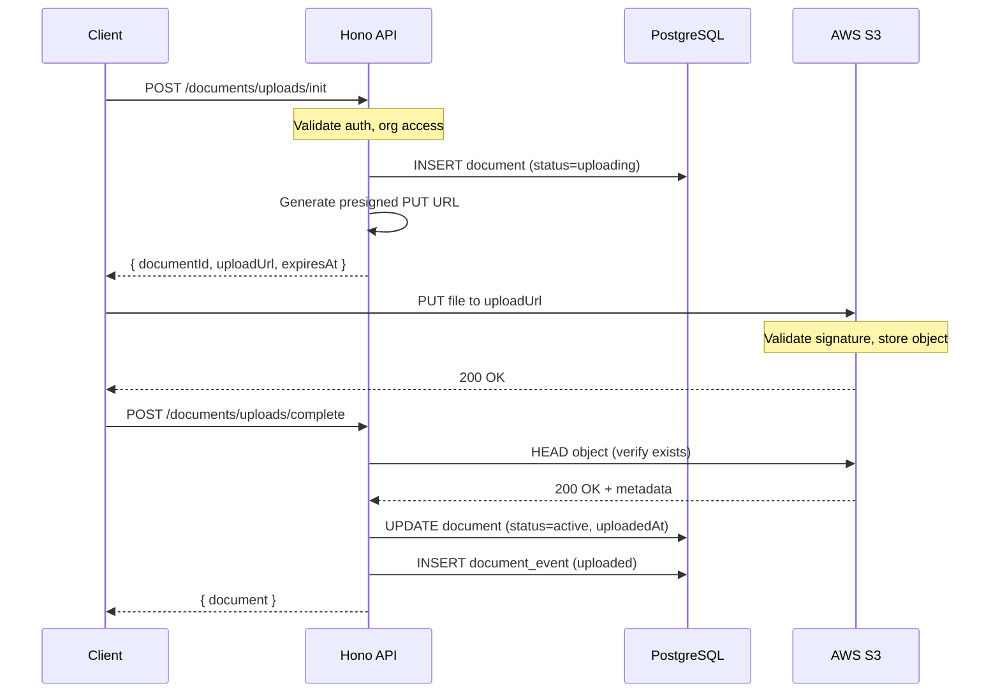
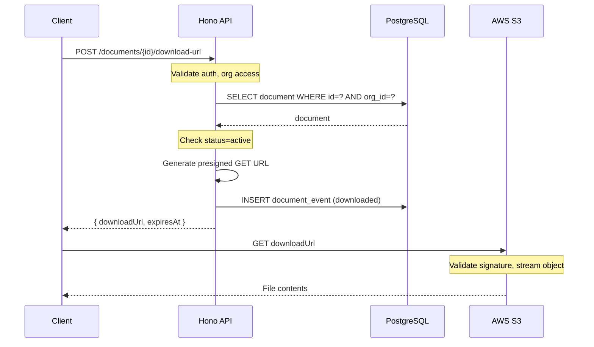

## Table of Contents

1. [Architecture Overview](#architecture-overview)
2. [Bucket Configuration](#bucket-configuration)
3. [Key Naming Convention](#key-naming-convention)
4. [Presigned URL Flows](#presigned-url-flows)
5. [IAM Permissions](#iam-permissions)
6. [Environment Variables](#environment-variables)
7. [Lifecycle Rules](#lifecycle-rules)
8. [Security Best Practices](#security-best-practices)

---

## Architecture Overview

```
┌──────────────────────────────────────────────────────────────────┐
│                    DOCUMENT STORAGE FLOW                          │
├──────────────────────────────────────────────────────────────────┤
│                                                                   │
│  ┌────────┐     1. Init Upload      ┌─────────────┐              │
│  │ Client │ ────────────────────►   │  Hono API   │              │
│  │        │                         │             │              │
│  │        │  ◄──────────────────    │  Creates    │              │
│  │        │   2. Presigned PUT URL  │  DB record  │              │
│  └────┬───┘                         └──────┬──────┘              │
│       │                                    │                      │
│       │ 3. PUT file directly               │ Creates document    │
│       │    to S3                           │ with status=uploading│
│       ▼                                    │                      │
│  ┌─────────────────────────────────────────▼─────────────────┐   │
│  │                      AWS S3 Bucket                         │   │
│  │  bumara-documents-{env}                                    │   │
│  │                                                            │   │
│  │  /{org_id}/{document_id}/{filename}                        │   │
│  │                                                            │   │
│  │  ✓ Private (no public access)                              │   │
│  │  ✓ SSE-S3 encryption                                       │   │
│  │  ✓ Versioning enabled (optional)                           │   │
│  │  ✓ CORS configured for app domain                          │   │
│  └────────────────────────────────────────────────────────────┘   │
│       │                                                           │
│       │ 4. Upload complete                                        │
│       ▼                                                           │
│  ┌────────┐     5. Complete Upload   ┌─────────────┐             │
│  │ Client │ ────────────────────►    │  Hono API   │             │
│  │        │                          │             │             │
│  │        │  ◄──────────────────     │  HEAD S3    │             │
│  │        │   6. Document active     │  Update DB  │             │
│  └────────┘                          └─────────────┘             │
│                                                                   │
└──────────────────────────────────────────────────────────────────┘
```

---

## Bucket Configuration

### Bucket Naming

| Environment | Bucket Name |
|-------------|-------------|
| Development | `bumara-documents-dev` |
| Staging | `bumara-documents-staging` |
| Production | `bumara-documents-production` |

### AWS Region

Primary region: `af-south-1` (Cape Town) for low latency to Zambian users.

### Bucket Settings

#### 1. Block Public Access

**Enable all public access blocking:**

```json
{
  "BlockPublicAcls": true,
  "IgnorePublicAcls": true,
  "BlockPublicPolicy": true,
  "RestrictPublicBuckets": true
}
```

#### 2. Encryption

**Server-side encryption with S3-managed keys (SSE-S3):**

```json
{
  "Rules": [{
    "ApplyServerSideEncryptionByDefault": {
      "SSEAlgorithm": "AES256"
    },
    "BucketKeyEnabled": true
  }]
}
```

#### 3. Versioning (Optional)

Enable for production to prevent accidental data loss:

```json
{
  "Status": "Enabled"
}
```

#### 4. CORS Configuration

Allow uploads from app domains:

```json
{
  "CORSRules": [
    {
      "AllowedOrigins": [
        "https://app.bumara.com",
        "https://backoffice.bumara.com",
        "http://localhost:3000"
      ],
      "AllowedMethods": ["GET", "PUT", "HEAD"],
      "AllowedHeaders": ["*"],
      "ExposeHeaders": ["ETag", "Content-Length"],
      "MaxAgeSeconds": 3600
    }
  ]
}
```

---

## Key Naming Convention

### Format

```
{organization_id}/{document_id}/{sanitized_filename}
```

### Examples

```
org_abc123/550e8400-e29b-41d4-a716-446655440000/invoice-2024-01.pdf
org_xyz789/661f9500-f39c-52e5-b827-557766551111/submission_screenshot.png
```

### Key Building Logic

```typescript
export function buildStorageKey(
  orgId: string, 
  documentId: string, 
  filename: string
): string {
  // Sanitize filename: keep only safe characters
  const sanitized = filename
    .replace(/[^a-zA-Z0-9._-]/g, "_")  // Replace unsafe chars with underscore
    .replace(/__+/g, "_")               // Collapse multiple underscores
    .substring(0, 200);                 // Limit length
  
  return `${orgId}/${documentId}/${sanitized}`;
}
```

### Why This Structure?

1. **Org isolation:** Keys are prefixed by org, preventing cross-org access
2. **Unique IDs:** Document ID ensures no filename collisions
3. **Human readable:** Original filename preserved for debugging
4. **Efficient listing:** Can list all documents for an org with prefix scan

---

## Presigned URL Flows

### Upload Flow (Presigned PUT)



### Presigned PUT URL Generation

```typescript
import { S3Client, PutObjectCommand } from "@aws-sdk/client-s3";
import { getSignedUrl } from "@aws-sdk/s3-request-presigner";

async function generateUploadUrl(
  storageKey: string,
  contentType: string,
  contentLength: number
): Promise<{ url: string; expiresAt: Date }> {
  const command = new PutObjectCommand({
    Bucket: process.env.S3_DOCUMENTS_BUCKET,
    Key: storageKey,
    ContentType: contentType,
    ContentLength: contentLength,
  });

  const expiresIn = 3600; // 1 hour
  const url = await getSignedUrl(s3Client, command, { expiresIn });
  const expiresAt = new Date(Date.now() + expiresIn * 1000);

  return { url, expiresAt };
}
```

### Upload Validation on Complete

```typescript
import { HeadObjectCommand } from "@aws-sdk/client-s3";

async function verifyUploadComplete(storageKey: string): Promise<{
  exists: boolean;
  contentLength?: number;
  contentType?: string;
}> {
  try {
    const response = await s3Client.send(
      new HeadObjectCommand({
        Bucket: process.env.S3_DOCUMENTS_BUCKET,
        Key: storageKey,
      })
    );
    
    return {
      exists: true,
      contentLength: response.ContentLength,
      contentType: response.ContentType,
    };
  } catch (error: any) {
    if (error.name === "NotFound") {
      return { exists: false };
    }
    throw error;
  }
}
```

### Download Flow (Presigned GET)



### Presigned GET URL Generation

```typescript
import { GetObjectCommand } from "@aws-sdk/client-s3";

async function generateDownloadUrl(
  storageKey: string,
  filename: string
): Promise<{ url: string; expiresAt: Date }> {
  const command = new GetObjectCommand({
    Bucket: process.env.S3_DOCUMENTS_BUCKET,
    Key: storageKey,
    // Force download with original filename
    ResponseContentDisposition: `attachment; filename="${encodeURIComponent(filename)}"`,
  });

  const expiresIn = 300; // 5 minutes
  const url = await getSignedUrl(s3Client, command, { expiresIn });
  const expiresAt = new Date(Date.now() + expiresIn * 1000);

  return { url, expiresAt };
}
```

---

## IAM Permissions

### Minimum Required Permissions

Create an IAM user or role with these permissions:

```json
{
  "Version": "2012-10-17",
  "Statement": [
    {
      "Sid": "DocumentsS3Access",
      "Effect": "Allow",
      "Action": [
        "s3:PutObject",
        "s3:GetObject",
        "s3:HeadObject",
        "s3:DeleteObject"
      ],
      "Resource": "arn:aws:s3:::bumara-documents-*/*"
    },
    {
      "Sid": "DocumentsS3ListBucket",
      "Effect": "Allow",
      "Action": [
        "s3:ListBucket"
      ],
      "Resource": "arn:aws:s3:::bumara-documents-*",
      "Condition": {
        "StringLike": {
          "s3:prefix": ["*"]
        }
      }
    }
  ]
}
```

### IAM Best Practices

1. **Use separate credentials per environment** (dev/staging/prod)
2. **Never commit credentials to code** - use environment variables
3. **Rotate credentials regularly** (every 90 days)
4. **Consider using IAM roles** with STS for Cloudflare Workers

### Cloudflare Workers + S3

For Cloudflare Workers, use short-lived credentials via AWS STS:

```typescript
import { STSClient, AssumeRoleCommand } from "@aws-sdk/client-sts";

async function getTemporaryCredentials() {
  const sts = new STSClient({ region: "af-south-1" });
  
  const response = await sts.send(
    new AssumeRoleCommand({
      RoleArn: "arn:aws:iam::123456789:role/BumaraDocumentsRole",
      RoleSessionName: "cloudflare-worker",
      DurationSeconds: 3600,
    })
  );
  
  return response.Credentials;
}
```

---

## Environment Variables

### Required Variables

```bash
# AWS Credentials
AWS_REGION=af-south-1
AWS_ACCESS_KEY_ID=AKIA...
AWS_SECRET_ACCESS_KEY=...

# S3 Bucket
S3_DOCUMENTS_BUCKET=bumara-documents-production

# Presigned URL Expiration
S3_UPLOAD_URL_EXPIRY_SECONDS=3600     # 1 hour for uploads
S3_DOWNLOAD_URL_EXPIRY_SECONDS=300    # 5 minutes for downloads

# Limits
S3_MAX_FILE_SIZE_BYTES=52428800       # 50MB
```

### Wrangler Configuration (Cloudflare Workers)

Add secrets using Wrangler:

```bash
wrangler secret put AWS_ACCESS_KEY_ID
wrangler secret put AWS_SECRET_ACCESS_KEY
```

---

## Lifecycle Rules

### Orphan Upload Cleanup

Objects that were never confirmed (no corresponding `active` document) should be cleaned up.

**Option A: S3 Lifecycle Rule**

Create a lifecycle rule to delete incomplete uploads after 24 hours:

```json
{
  "Rules": [
    {
      "ID": "AbortIncompleteMultipartUpload",
      "Status": "Enabled",
      "Filter": {},
      "AbortIncompleteMultipartUpload": {
        "DaysAfterInitiation": 1
      }
    }
  ]
}
```

**Option B: Scheduled Cleanup Job (Recommended)**

Run a daily job that:

1. Finds documents with `status = 'uploading'` AND `created_at < NOW() - 24h`
2. Marks them as `status = 'failed'`
3. Optionally deletes the S3 object

```typescript
async function cleanupOrphanUploads() {
  const orphans = await db
    .select()
    .from(documents)
    .where(
      and(
        eq(documents.status, "uploading"),
        lt(documents.createdAt, subHours(new Date(), 24))
      )
    );
  
  for (const doc of orphans) {
    // Mark as failed
    await db
      .update(documents)
      .set({ status: "failed" })
      .where(eq(documents.id, doc.id));
    
    // Optionally delete from S3
    await s3Client.send(
      new DeleteObjectCommand({
        Bucket: BUCKET,
        Key: doc.storageKey,
      })
    );
  }
  
  return orphans.length;
}
```

### Archived Document Retention

Documents with `status = 'archived'` should be retained for compliance. Consider:

- **30-day soft delete window** before permanent deletion
- **Transition to Glacier** after 90 days for cost savings
- **Legal hold** for documents under investigation

---

## Security Best Practices

### 1. Never Expose Bucket Directly

- All access must go through presigned URLs
- Presigned URLs have short TTL (5 min for download, 1 hour for upload)
- URLs are single-use by design

### 2. Validate Content-Type on Upload

The presigned PUT URL includes `Content-Type`. Verify it matches an allowed list:

```typescript
const ALLOWED_MIME_TYPES = [
  "application/pdf",
  "image/jpeg",
  "image/png",
  "image/webp",
  "application/vnd.openxmlformats-officedocument.spreadsheetml.sheet", // xlsx
  "application/vnd.openxmlformats-officedocument.wordprocessingml.document", // docx
  "text/csv",
];

function validateMimeType(mimeType: string): boolean {
  return ALLOWED_MIME_TYPES.includes(mimeType);
}
```

### 3. Validate File Size

Enforce maximum file size both in presigned URL and on complete:

```typescript
const MAX_FILE_SIZE = 50 * 1024 * 1024; // 50MB

function validateFileSize(sizeBytes: number): boolean {
  return sizeBytes > 0 && sizeBytes <= MAX_FILE_SIZE;
}
```

### 4. Audit All Access

Log every presigned URL generation:

- Who requested it (userId, orgId)
- What document
- When
- IP address and user agent (if available)

### 5. Consider Malware Scanning (Future)

For production, consider:

- **AWS Lambda trigger** on S3 PutObject to scan with ClamAV
- **Third-party service** like Cloudflare or Trend Micro
- **Quarantine bucket** for suspicious files

Until implemented, add a `quarantine` status placeholder.

---

## Troubleshooting

### "AccessDenied" on presigned URL

1. Check IAM permissions
2. Verify bucket name matches
3. Check if URL has expired
4. Ensure Content-Type header matches (for PUT)

### "SignatureDoesNotMatch" error

1. Content-Length header must match exactly
2. Content-Type header must match exactly
3. URL may have been modified or truncated

### Upload succeeds but complete fails

1. Check that object key matches expected storageKey
2. Verify HEAD request permissions
3. Check for eventual consistency (rare, wait and retry)

### Large file upload fails

1. Files > 5GB need multipart upload
2. Consider chunked upload with presigned URL per part
3. Current limit is 50MB for simplicity

