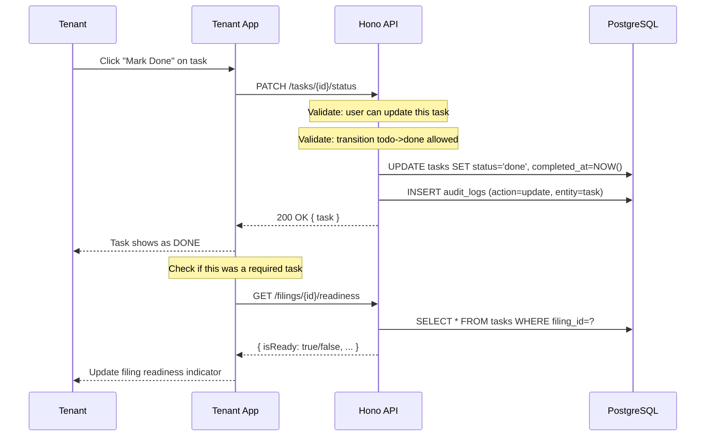
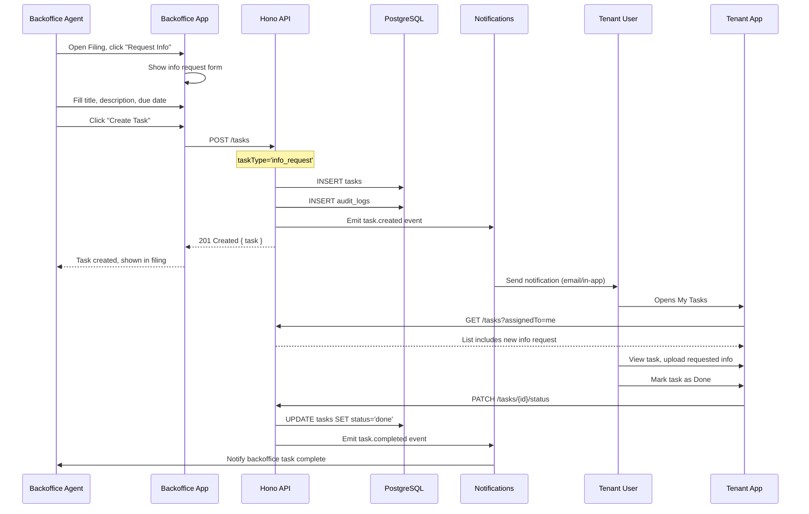
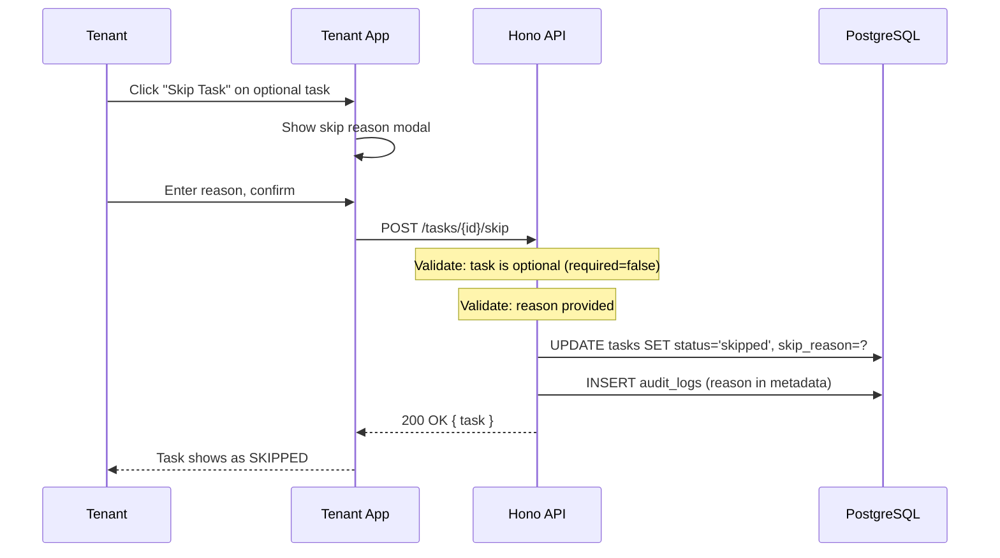

## Table of Contents

1. [Tenant App Flows](#tenant-app-flows)
2. [Backoffice Flows](#backoffice-flows)
3. [Filing Readiness Gating](#filing-readiness-gating)
4. [Sequence Diagrams](#sequence-diagrams)

---

## Tenant App Flows

### 1. My Tasks View

**Location:** `/compliance/tasks` or `/regulators/{regulator}/tasks`

**Purpose:** Show all tasks assigned to or relevant to the current user.

**UI Components:**

```
┌─────────────────────────────────────────────────────────────────────┐
│  Tasks                                                               │
│  ─────────────────────────────────────────────────────────────────  │
│  [My Tasks] [Org Tasks] [Blocked]          🔍 Search...             │
│                                                                      │
│  ┌──────────────────────────────────────────────────────────────┐   │
│  │ Parent Type: [All ▼]  Status: [All ▼]  Due: [All ▼]  Sort ▼  │   │
│  └──────────────────────────────────────────────────────────────┘   │
│                                                                      │
│  ┌──────────────────────────────────────────────────────────────┐   │
│  │ ☐ Upload Annual Return Documents          [Required]          │   │
│  │   Filing: PACRA Annual Return — 2025      Due: Dec 15, 2025  │   │
│  │   ● TODO                                  [View details]     │   │
│  └──────────────────────────────────────────────────────────────┘   │
│                                                                      │
│  ┌──────────────────────────────────────────────────────────────┐   │
│  │ ☐ Provide Director Contact Information    [Optional]          │   │
│  │   Request: Change of Directors            Due: Jan 10, 2026  │   │
│  │   ● DOING                                 [View details]     │   │
│  └──────────────────────────────────────────────────────────────┘   │
│                                                                      │
└─────────────────────────────────────────────────────────────────────┘
```

**Filters:**

| Filter | Options | Default |
|--------|---------|---------|
| View | My Tasks, Org Tasks, Blocked | My Tasks |
| Parent Type | All, Filings, Service Requests | All |
| Status | All, Todo, Doing, Blocked, Done | All (excludes done for active views) |
| Due | All, Due Soon (7 days), Overdue | All |
| Sort | Due Date, Updated, Priority | Due Date |

**Code Reference:** `apps/app/features/pacra/tasks/pacra-tasks-client.tsx`

### 2. Task Details Drawer

**Trigger:** Click "View details" on any task row.

**Purpose:** Full task information with actions.

**UI Components:**

```
┌─────────────────────────────────────────────┐
│ Task Details                            ✕   │
├─────────────────────────────────────────────┤
│                                             │
│ Upload Annual Return Documents              │
│ [TODO] [Required]                           │
│                                             │
│ ─────────────────────────────────────────── │
│ CONTEXT                                     │
│ ┌─────────────────────────────────────────┐ │
│ │ Filing: PACRA Annual Return — 2025      │ │
│ │                           [View Filing] │ │
│ └─────────────────────────────────────────┘ │
│                                             │
│ DATES                                       │
│ ┌──────────────┐  ┌──────────────────────┐ │
│ │ Due          │  │ Last Updated         │ │
│ │ Dec 15, 2025 │  │ Dec 1, 2025          │ │
│ │ ● On track   │  │ Created: Nov 20      │ │
│ └──────────────┘  └──────────────────────┘ │
│                                             │
│ NOTES & DOCUMENTS                           │
│ ┌─────────────────────────────────────────┐ │
│ │ Notes: 2        [Add note]              │ │
│ │ Documents: 0    [Upload document]       │ │
│ └─────────────────────────────────────────┘ │
│                                             │
│ ACTIONS                                     │
│ [Mark In Progress]                          │
│ [Mark Done]                                 │
│                                             │
└─────────────────────────────────────────────┘
```

**Actions by Status:**

| Current Status | Available Actions |
|----------------|-------------------|
| `todo` | Mark In Progress, Mark Done |
| `doing` | Mark Done, Mark Blocked (with reason) |
| `blocked` | Mark In Progress (clears block), Mark Done |
| `done` | Reopen (with permission) |
| `skipped` | Reopen (with permission) |

**Code Reference:** `apps/app/features/pacra/tasks/components/task-details-sheet.tsx`

### 3. Filing-Level Task List

**Location:** Filing detail page, "Tasks" tab or section.

**Purpose:** Show all tasks for a specific Filing.

**UI Components:**

```
┌─────────────────────────────────────────────────────────────────────┐
│ PACRA Annual Return — 2025                                          │
│                                                                      │
│ ┌───────────────────────────────────────────────────────────────┐   │
│ │ Status: IN_PROGRESS          Due: Dec 31, 2025                │   │
│ │ Tasks: 2/3 complete          Readiness: ⚠️ Not Ready          │   │
│ └───────────────────────────────────────────────────────────────┘   │
│                                                                      │
│ [Overview] [Tasks] [Documents] [Timeline]                           │
│                                                                      │
│ TASKS (3)                                                            │
│ ─────────────────────────────────────────────────────────────────   │
│                                                                      │
│ Required Tasks                                                       │
│ ┌──────────────────────────────────────────────────────────────┐   │
│ │ ✓ Upload Financial Statements           DONE                  │   │
│ │ ☐ Upload Annual Return Form             TODO    Due: Dec 15  │   │
│ └──────────────────────────────────────────────────────────────┘   │
│                                                                      │
│ Optional Tasks                                                       │
│ ┌──────────────────────────────────────────────────────────────┐   │
│ │ ✓ Provide Updated Contact Info          DONE                  │   │
│ └──────────────────────────────────────────────────────────────┘   │
│                                                                      │
│ ⚠️ Complete all required tasks to submit this filing               │
│                                                                      │
└─────────────────────────────────────────────────────────────────────┘
```

**Readiness Indicator:**

| State | Display |
|-------|---------|
| All required done | ✅ Ready for Submission |
| Some required incomplete | ⚠️ Not Ready (X of Y required tasks done) |
| Has blocked tasks | 🔴 Blocked — requires attention |

---

## Backoffice Flows

### 1. Task Queue View

**Location:** `/compliance/tasks/team-tasks`

**Purpose:** View all tasks across tenants that require backoffice attention.

**Filters:**

- By tenant organization
- By regulator
- By task type (especially `info_request`)
- By status
- By due date

### 2. Info Request Task Creation

**Location:** Filing or Service Request detail page in backoffice.

**Purpose:** Backoffice agent creates a task requesting information from the tenant.

**Flow:**

```
┌─────────────────────────────────────────────────────────────────────┐
│ Create Info Request                                                  │
│ ─────────────────────────────────────────────────────────────────   │
│                                                                      │
│ Title: *                                                             │
│ ┌───────────────────────────────────────────────────────────────┐   │
│ │ Please provide updated bank statements                         │   │
│ └───────────────────────────────────────────────────────────────┘   │
│                                                                      │
│ Description:                                                         │
│ ┌───────────────────────────────────────────────────────────────┐   │
│ │ We need bank statements for the last 3 months to verify...    │   │
│ │                                                                │   │
│ └───────────────────────────────────────────────────────────────┘   │
│                                                                      │
│ Due Date: [Dec 20, 2025 📅]                                         │
│                                                                      │
│ Required: [ ] Yes, tenant cannot submit without this                │
│                                                                      │
│                               [Cancel]  [Create Task]               │
│                                                                      │
└─────────────────────────────────────────────────────────────────────┘
```

**On Create:**

1. Task created with `taskType = 'info_request'`
2. Task status = `todo`
3. Parent = current Filing or Service Request
4. Tenant receives notification (in-app, email)
5. Audit log records creation by backoffice agent

### 3. Task Assignment

**Purpose:** Assign a task to a specific tenant org member.

**UI:** Dropdown in task detail or inline edit in task list.

**Notes:**
- Only org admins/managers can assign tasks
- Assignee can be changed at any time before completion
- Assignment change triggers notification to new assignee

---

## Filing Readiness Gating

### Readiness Check Logic

```typescript
interface ReadinessResult {
  isReady: boolean;
  totalRequired: number;
  completedRequired: number;
  blockedTasks: Task[];
  pendingRequired: Task[];
}

function checkFilingReadiness(tasks: Task[]): ReadinessResult {
  const requiredTasks = tasks.filter(t => t.required);
  const completedRequired = requiredTasks.filter(t => t.status === 'done');
  const blockedTasks = tasks.filter(t => t.status === 'blocked');
  const pendingRequired = requiredTasks.filter(t =>
    t.status !== 'done' && t.status !== 'skipped'
  );

  return {
    isReady: pendingRequired.length === 0 && blockedTasks.length === 0,
    totalRequired: requiredTasks.length,
    completedRequired: completedRequired.length,
    blockedTasks,
    pendingRequired,
  };
}
```

### Status Transition Guard

When tenant attempts to change Filing status to `READY_FOR_SUBMISSION`:

```typescript
async function validateFilingReadiness(filingId: string): Promise<void> {
  const tasks = await getTasksForFiling(filingId);
  const readiness = checkFilingReadiness(tasks);

  if (!readiness.isReady) {
    throw new ConflictError(
      'Cannot submit: not all required tasks are complete',
      {
        hint: `Complete ${readiness.pendingRequired.length} remaining required task(s)`,
        pendingTasks: readiness.pendingRequired.map(t => t.id),
        blockedTasks: readiness.blockedTasks.map(t => t.id),
      }
    );
  }
}
```

---

## Sequence Diagrams

### Task Completion Flow



### Info Request Flow



### Skip Task Flow (Optional Task)



---

## Mobile Considerations

### Responsive Design

- Task list uses card layout on mobile, table on desktop
- Task details drawer becomes full-screen sheet on mobile
- Filters collapse into a "Filters" button on mobile
- Touch-friendly action buttons

### Offline Behavior

- Task list cached locally for viewing
- Status updates queue when offline
- Sync on reconnect with conflict resolution

---

## Accessibility

### Keyboard Navigation

- Tab through task list items
- Enter to open task details
- Escape to close drawer/modal
- Arrow keys for filter navigation

### Screen Readers

- Task status announced with item
- Required badge read as "Required task"
- Due date and overdue state announced
- Action buttons have descriptive labels

### Color Considerations

- Status not conveyed by color alone (icons used)
- Sufficient contrast for all text
- Focus indicators visible


