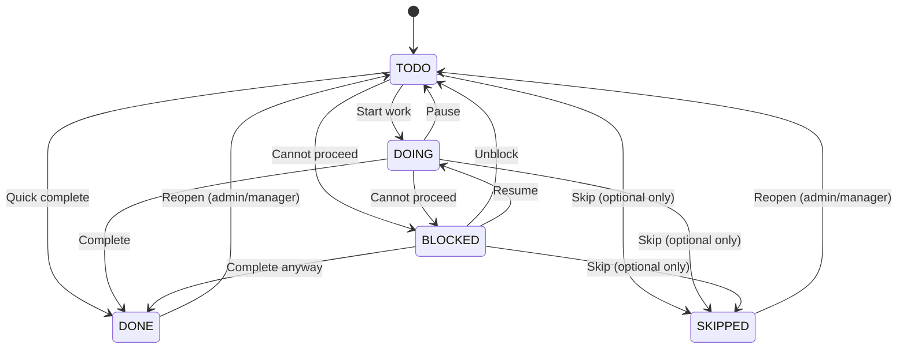

## 1. What is a Task?

A **Task** is a checklist step tied to a **single parent entity**:
- **Filing** (period instance from obligation) — e.g., "VAT — Nov 2025"
- **Service Request (Case)** — e.g., "Name Clearance #12345"

Tasks are **not free-floating**. Every task must belong to exactly one parent entity.

### Task Types

| Type | Description |
|------|-------------|
| `upload_document` | Upload required document |
| `fill_form` | Complete a form section |
| `review_approve` | Confirmation/acknowledgment |
| `payment_action` | Payment required |
| `info_request` | Information gathering |
| `custom` | General task |

---

## 2. Task Lifecycle (State Machine)



### Status Definitions

| Status | Description |
|--------|-------------|
| `todo` | Not started |
| `doing` | In progress |
| `blocked` | Cannot proceed (reason required) |
| `done` | Completed |
| `skipped` | Skipped (optional tasks only, reason required) |

### Transition Rules

- `BLOCKED` requires `blocked_reason`
- `SKIPPED` requires `skip_reason`
- Reopening `DONE`/`SKIPPED` requires admin/manager role

---

## 3. Task Action Anchors

Tasks can link to specific UI sections via **action anchors**:

### Action Kinds

| Kind | Description | Example |
|------|-------------|---------|
| `navigate` | Deep link to page/section | Link to filing details |
| `form_section` | Links to form key + section | Employer details section |
| `doc_upload` | Links to document requirement | Payroll summary upload |
| `confirmation` | Acknowledgment step | Terms acceptance |
| `none` | No action anchor | Generic task |

### Action Reference Structure

```typescript
interface ActionRef {
  href?: string;           // Relative path
  anchor?: string;         // Page anchor (#section)
  formKey?: string;        // Form identifier
  section?: string;        // Form section key
  docRequirementGroup?: string;  // Doc requirement key
}
```

### Examples

**Name Clearance "Enter Names" task:**
```json
{
  "actionKind": "form_section",
  "actionRef": {
    "formKey": "PACRA_NAME_CLEARANCE",
    "section": "names"
  }
}
```

**PAYE Registration "Employer Details" task:**
```json
{
  "actionKind": "form_section",
  "actionRef": {
    "href": "/regulators/zra/services/register-paye",
    "formKey": "ZRA_REGISTER_PAYE",
    "section": "employer_details"
  }
}
```

---

## 4. How Tasks Are Used

### 4.1 Regulators

Tasks can be filtered by regulator for focused views:
- `/regulators/pacra/tasks` — All PACRA tasks
- `/regulators/zra/tasks` — All ZRA tasks

Regulator is derived from parent entity (filing or service request).

### 4.2 Filings

Tasks are auto-generated when a filing is created from an obligation template:
- Template defines `taskTemplateConfigs` JSONB
- Activation engine creates tasks with `templateKey` for idempotency
- Tasks inherit due dates relative to filing due date

### 4.3 Service Requests

Tasks are auto-generated when a service request is created from a template:
- Template defines `taskTemplateConfigs` JSONB
- Tasks created during `createServiceRequest`
- Linked via `service_request_id`

### 4.4 Submission Readiness

Tasks gate submission readiness for both filings and service requests.

---

## 5. Readiness Gates

A Filing or Service Request becomes **READY_FOR_SUBMISSION** when:

1. ✅ All **required tasks** are `DONE` or `SKIPPED` (with reason)
2. ✅ All **required document requirements** are satisfied
3. ✅ No tasks are `BLOCKED`
4. ✅ Required payload sections are saved (if applicable)

### Readiness Computation

```typescript
function computeReadiness(entity: Filing | ServiceRequest): ReadinessResult {
  const tasks = getEntityTasks(entity);
  const docRequirements = getDocRequirements(entity);
  
  const pendingRequired = tasks.filter(t => 
    t.required && t.status !== 'done' && t.status !== 'skipped'
  );
  const blockedTasks = tasks.filter(t => t.status === 'blocked');
  const missingDocs = docRequirements.filter(r => r.required && !r.satisfied);
  
  return {
    isReady: pendingRequired.length === 0 
          && blockedTasks.length === 0 
          && missingDocs.length === 0,
    pendingRequired,
    blockedTasks,
    missingDocs,
  };
}
```

### Auto-Transition

When a task is marked `DONE`:
1. System checks if parent entity is ready
2. If ready and status is `pending_data` or `in_progress`:
   - Auto-transition to `ready_for_submission`
   - Record audit log with trigger `auto_task_completion`

---

## 6. Task Automation

### Form Section → Task Completion

When a form section is saved:
1. Find tasks where `actionKind = 'form_section'` and `actionRef.section` matches
2. Auto-complete matching tasks
3. Recompute parent readiness

### Document Upload → Task Completion

When a document is uploaded and satisfies a requirement:
1. Find tasks where `actionKind = 'doc_upload'` and `actionRef.docRequirementGroup` matches
2. Auto-complete matching tasks
3. Recompute parent readiness

---

## 7. Completion Triggers

Tasks have a `completion_trigger` column that enables efficient auto-completion lookups.

### Trigger Format

| Action Kind | Trigger Format | Example |
|-------------|----------------|---------|
| `form_section` | `form:{formKey}:{section}` | `form:PACRA_BUSINESS_NAME:business_details` |
| `doc_upload` | `doc:{requirementKey}` | `doc:owner_nrc_copies` |
| `confirmation` | `confirm:{anchor}` | `confirm:submit` |
| `navigate` / `none` | `manual` | `manual` |

### Using Completion Triggers

```typescript
// When a form section is saved
await completeTasksByTrigger(ctx, deps, {
  parentType: "service_request",
  parentId: serviceRequestId,
  trigger: `form:${formKey}:${section}`,
});

// Convenience helper
await completeTasksOnFormSave(ctx, deps, {
  parentType: "service_request",
  parentId: serviceRequestId,
  formKey: "PACRA_BUSINESS_NAME",
  section: "business_details",
});

// When a document is uploaded
await completeTasksOnDocUpload(ctx, deps, {
  parentType: "service_request",
  parentId: serviceRequestId,
  requirementKey: "owner_nrc_copies",
});
```

### Benefits

1. **Indexed lookups** - The `completion_trigger` column is indexed for fast queries
2. **Simpler matching** - No JSONB path queries needed
3. **Predictable** - Trigger format is deterministic from template config

---

## 8. Audit Logging

All task status transitions must create audit log entries:

```typescript
{
  action: "update",
  entityType: "task",
  entityId: taskId,
  changes: {
    before: { status: oldStatus },
    after: { status: newStatus },
  },
  metadata: {
    regulatorId,
    filingId,
    serviceRequestId,
    title: task.title,
    reason: blockedReason || skipReason,
  },
}
```

Parent entity transitions triggered by task completion also require audit logs.
