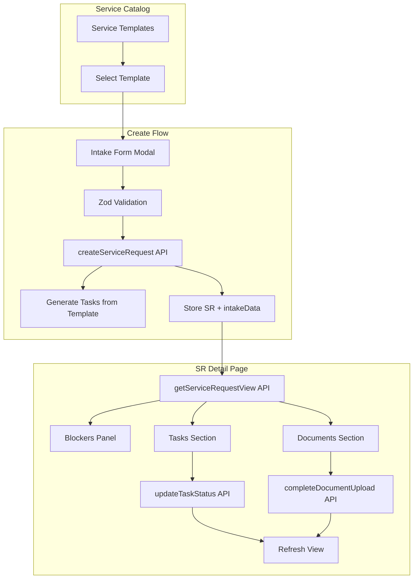

## Summary

This implementation adds comprehensive service request functionality to the PACRA workspace, allowing tenants to:
- Browse and start new service requests from a catalog
- Complete intake forms when creating requests
- Complete tasks (review, form, upload types)
- Upload required documents
- Track progress and see blockers

---

## Architecture

### Data Flow



### Component Structure

```
apps/app/features/
├── compliance/components/           # Shared components (new)
│   ├── blockers-panel.tsx          # Generic blockers display
│   ├── entity-tasks-section.tsx    # Tasks with inline completion
│   ├── entity-documents-section.tsx # Document requirements + upload
│   └── index.ts
├── service-requests/components/     # SR-specific components (new)
│   ├── intake-form.tsx             # Dynamic form from schema
│   ├── intake-modal.tsx            # Create flow with intake
│   └── index.ts
└── regulators/components/
    └── service-requests/            # Updated to use IntakeModal
```

---

## API Endpoints

### New Endpoint: `GET /service-requests/{id}/view`

Returns aggregated service request view with all data needed for detail page.

**Response:**

```typescript
{
  serviceRequest: {
    id: string;
    organizationId: string;
    regulatorId: string | null;
    templateId: string | null;
    name: string;
    status: ServiceRequestStatus;
    // ... other fields
  };
  tasks: Array<{
    id: string;
    title: string;
    description: string | null;
    taskType: string;
    required: boolean;
    status: string;
    payload: Record<string, unknown> | null;
    // ... other fields
  }>;
  docRequirements: Array<{
    key: string;
    name: string;
    description: string | null;
    kind: string;
    required: boolean;
    satisfied: boolean;
    satisfiedByDocId: string | null;
    satisfiedByDocFilename: string | null;
  }>;
  documents: Array<{
    id: string;
    filename: string | null;
    kind: string;
    requirementKey: string | null;
    // ... other fields
  }>;
  progress: {
    tasksDone: number;
    tasksTotal: number;
    docsDone: number;
    docsTotal: number;
  };
  blockers: {
    isReady: boolean;
    blockedTasks: Array<{ id: string; title: string; reason: string | null }>;
    pendingRequiredTasks: Array<{ id: string; title: string; status: string }>;
    missingRequiredDocs: Array<{ key: string; name: string }>;
  };
}
```

---

## Components

### 1. BlockersPanel

Generic component showing what's blocking a filing/SR from being ready.

**Props:**
```typescript
interface BlockersPanelProps {
  blockers: BlockersData;
  className?: string;
}
```

**Features:**
- Shows ready state with green styling when `isReady` is true
- Lists blocked tasks with reasons
- Lists pending required tasks with status
- Lists missing required documents

### 2. EntityTasksSection

Generic task management with inline completion.

**Props:**
```typescript
interface EntityTasksSectionProps {
  entityType: "filing" | "service_request";
  entityId: string;
  tasks: EntityTask[];
  progress: { tasksDone: number; tasksTotal: number };
  className?: string;
}
```

**Supported Task Types:**
- `review_approve` / `info_request`: Checkbox completion
- `fill_form` / `custom`: Expandable with textarea
- `upload_document`: Shows link to documents section
- `payment_action`: Display only (handled in payments tab)

### 3. EntityDocumentsSection

Generic document requirements and upload.

**Props:**
```typescript
interface EntityDocumentsSectionProps {
  entityType: "filing" | "service_request";
  entityId: string;
  regulatorId?: string;
  docRequirements: DocRequirement[];
  documents: EntityDocument[];
  progress: { docsDone: number; docsTotal: number };
  className?: string;
}
```

**Features:**
- Groups documents by required/optional
- Shows satisfaction status per requirement
- Drag-and-drop upload dialog
- Supports replacing existing documents

### 4. IntakeForm

Dynamic form renderer based on template schema.

**Props:**
```typescript
interface IntakeFormProps {
  fields: IntakeFieldSchema[];
  onSubmit: (data: Record<string, unknown>) => Promise<void>;
  isSubmitting?: boolean;
  submitLabel?: string;
}
```

**Supported Field Types:**
- `text` - Single line input
- `textarea` - Multi-line input
- `select` - Dropdown with options
- `date` - Date picker
- `number` - Numeric input
- `email` - Email input with validation

### 5. IntakeModal

Modal for creating service requests with intake form.

**Props:**
```typescript
interface IntakeModalProps {
  open: boolean;
  onOpenChange: (open: boolean) => void;
  template: {
    id: string;
    name: string;
    description?: string | null;
    intakeFieldsSchema?: IntakeFieldSchema[] | Record<string, unknown> | null;
  };
  regulatorKey: string;
}
```

---

## Files Changed

### New Files

| File | Purpose |
|------|---------|
| `docs/regulators/pacra/step2-service-requests-scan.md` | Scan document |
| `docs/regulators/pacra/step2-service-requests.md` | This file |
| `apps/app/features/compliance/components/blockers-panel.tsx` | Shared blockers panel |
| `apps/app/features/compliance/components/entity-tasks-section.tsx` | Shared tasks section |
| `apps/app/features/compliance/components/entity-documents-section.tsx` | Shared documents section |
| `apps/app/features/compliance/components/index.ts` | Exports |
| `apps/app/features/service-requests/components/intake-form.tsx` | Dynamic intake form |
| `apps/app/features/service-requests/components/intake-modal.tsx` | Create flow modal |
| `apps/app/features/service-requests/components/index.ts` | Exports |

### Modified Files

| File | Changes |
|------|---------|
| `packages/api-services/.../service-requests.schema.ts` | Added view response schemas |
| `packages/api-services/.../service-requests.service.ts` | Added `getServiceRequestView` |
| `packages/backend/.../service-requests/routes.ts` | Added view route |
| `packages/backend/.../service-requests/handlers.ts` | Added view handler |
| `packages/backend/.../compliance/index.ts` | Registered new route |
| `apps/app/lib/queries/regulators/types.ts` | Added view types |
| `apps/app/lib/queries/regulators/fetchers/service-requests.ts` | Added view fetcher |
| `apps/app/lib/queries/regulators/hooks/use-service-requests.ts` | Added `useServiceRequestView` |
| `apps/app/.../pacra/service-requests/[id]/page.tsx` | Upgraded to use view + components |
| `apps/app/.../pacra/service-requests/page.tsx` | Include intake schema in templates |
| `apps/app/features/regulators/components/service-requests/service-requests-content.tsx` | Use IntakeModal |

---

## PACRA Templates Supported

| Template | Key | Intake Fields | Tasks | Doc Requirements |
|----------|-----|---------------|-------|------------------|
| Name Clearance | `PACRA_NAME_CLEARANCE_V1` | 5 fields | 2 | 0 |
| Change Directors | `PACRA_CHANGE_DIRECTORS_V1` | 3 fields | 5 | 4 |
| Change Registered Office | `PACRA_CHANGE_REGISTERED_OFFICE_V1` | 4 fields | 3 | 2 |

---

## Usage

### Creating a Service Request

1. Navigate to `/regulators/pacra/service-requests`
2. Click a featured service or "New Request"
3. Fill the intake form (if template has intake fields)
4. Submit to create the request
5. Redirected to detail page

### Completing a Service Request

1. Navigate to service request detail page
2. View "What to do next" panel for blockers
3. Complete tasks in the Tasks tab
4. Upload documents in the Documents tab
5. When all required items done, status shows "Ready for Submission"

---

## Known Gaps / Future Work

1. **Request Submission Flow** - Not implemented in this step
2. **Payment Integration** - Display only, no payment processing
3. **Intake Data Storage** - Not persisted on SR record (schema has `intakeData` but not wired)
4. **Document Task Auto-Completion** - Upload tasks don't auto-complete when doc is uploaded
5. **Timeline/Audit Log Display** - Not shown on detail page

---

## Testing Checklist

- [ ] Create service request from featured services
- [ ] Create service request from catalog
- [ ] Intake form validation works
- [ ] Service request detail shows tasks
- [ ] Complete review/approval task (checkbox)
- [ ] Complete form task (textarea + save)
- [ ] Upload document to satisfy requirement
- [ ] Progress updates in real-time
- [ ] Blockers panel shows correct items
- [ ] Ready state shows when all complete
