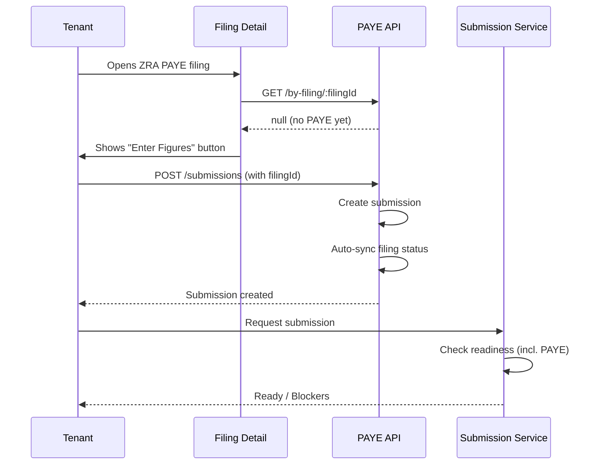

## Overview

ZRA PAYE (Pay As You Earn) is a monthly tax obligation for employers. This module integrates PAYE data capture with the compliance filing workflow.

---

## Template Configuration

### Template Metadata

| Field | Value |
|-------|-------|
| Template Key | `ZRA_PAYE_MONTHLY_V1` |
| Template Version | 1 |
| Regulator | ZRA |
| Frequency | Monthly |
| Due Date Rule | `PERIOD_END_PLUS_DAYS` (14 days) |
| Payment Required | Yes |
| Fee Key | `ZRA_PAYE_MONTHLY` |

### Tasks

| # | Key | Title | Type | Required |
|---|-----|-------|------|----------|
| 1 | `enter_payroll_totals` | Enter Payroll Totals | fill_form | Yes |
| 2 | `validate_employee_counts` | Validate Employee Counts | review_approve | Yes |
| 3 | `upload_payroll_summary` | Upload Payroll Summary | upload_document | Yes |
| 4 | `confirm_submission` | Review & Confirm | review_approve | Yes |

### Task Auto-Completion Triggers

- `form:ZRA_PAYE_FIGURES:payroll_totals` → Completes `enter_payroll_totals`
- `form:ZRA_PAYE_FIGURES:employee_validation` → Completes `validate_employee_counts`
- `doc:payroll_summary` → Completes `upload_payroll_summary`
- `confirm:submit` → Completes `confirm_submission`

### Document Requirements

| Key | Name | Required |
|-----|------|----------|
| `payroll_summary` | Payroll Summary | Yes |
| `employee_list` | Employee List (Optional) | No |

---

## Core Concepts

### Filing-PAYE Link
- `paye_submissions.filingId` links PAYE data to compliance filings
- One PAYE submission per filing (not enforced at DB level, checked in service)
- Endpoint: `GET /zra/paye/by-filing/:filingId`

### Status Auto-Sync
When a PAYE submission is created with a linked `filingId`:
- **Nil return with reason** → Filing status becomes `ready_for_submission`
- **With employees** → Filing status becomes `in_progress`

### Submission Readiness
`computeSubmissionReadiness()` checks:
1. Tasks complete
2. Documents uploaded
3. Payment verified (if required)
4. **PAYE data present** (for ZRA PAYE filings)

If no linked PAYE submission exists, the `payeData` blocker is returned.

---

## API Endpoints

### Tenant API

| Method | Path | Description |
|--------|------|-------------|
| GET | `/zra/paye/by-filing/:filingId` | Get PAYE submission by filing |
| POST | `/zra/paye/submissions` | Create PAYE submission |
| GET | `/zra/paye/submissions` | List submissions |
| GET | `/zra/paye/submissions/:id` | Get submission with employees |
| PATCH | `/zra/paye/submissions/:id/status` | Update status |
| POST | `/zra/paye/submissions/:id/employees` | Add employee |
| PATCH | `/zra/paye/submissions/:submissionId/employees/:employeeId` | Update employee |
| DELETE | `/zra/paye/submissions/:submissionId/employees/:employeeId` | Delete employee |
| GET | `/zra/paye/prefill-data` | Get prefill from previous period |

---

## Data Model

### filingId Column
```sql
ALTER TABLE paye_submissions
ADD COLUMN filing_id UUID REFERENCES filings(id) ON DELETE SET NULL;

CREATE INDEX idx_paye_submissions_filing ON paye_submissions(filing_id);
```

### Key Fields
- `isNilReturn` - Boolean flag for nil returns
- `nilReason` - Enum: `no_employees`, `below_threshold`, `temporarily_inactive`, `seasonal`, `unpaid_leave`, `other`
- `status` - Enum: `draft`, `pending`, `processing`, `accepted`, `rejected`, `late`, `amended`

---

## UI Integration

### FilingDetailPageContent
The `PayeFiguresSection` component is rendered for ZRA PAYE filings:
- Checks `regulator === 'zra'` and `templateKey` contains `paye`
- Fetches PAYE data via `/zra/paye/by-filing/:filingId`
- Shows summary if exists, "Enter Figures" prompt if not

---

## Workflow



---

## Testing Checklist

- [ ] Create PAYE submission with `filingId`
- [ ] Verify filing status syncs correctly
- [ ] Nil return → `ready_for_submission`
- [ ] With employees → `in_progress`
- [ ] `GET /by-filing/:filingId` returns linked submission
- [ ] Readiness check blocks if no PAYE data
- [ ] UI shows summary or entry prompt

---

## Related Files

| File | Purpose |
|------|---------|
| `packages/database/src/schema/zra/paye-submissions.ts` | Schema with `filingId` |
| `packages/database/src/repositories/zra.ts` | `findPayeSubmissionByFilingId()` |
| `packages/api-services/src/domains/zra/zra-paye.service.ts` | Service with filing sync |
| `packages/backend/src/modules/zra/paye/` | Routes & handlers |
| `apps/app/features/zra/components/paye-figures-section.tsx` | Tenant UI component |
| `packages/api-services/src/domains/submissions/` | Readiness with PAYE check |
